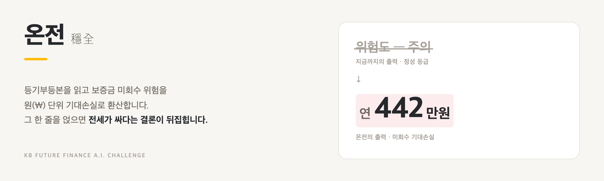
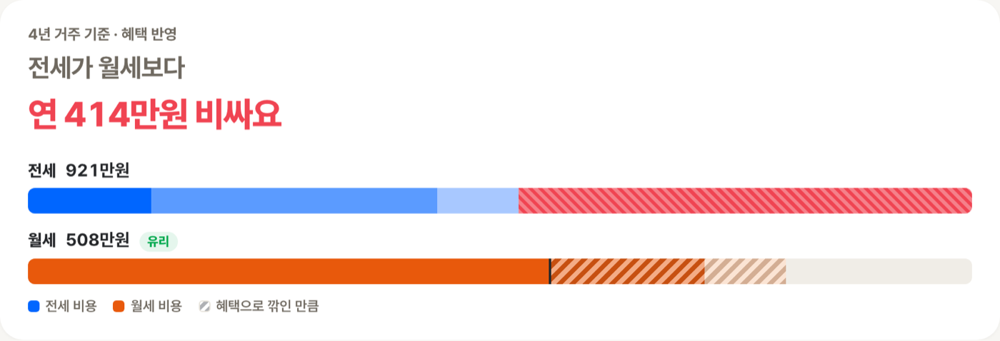
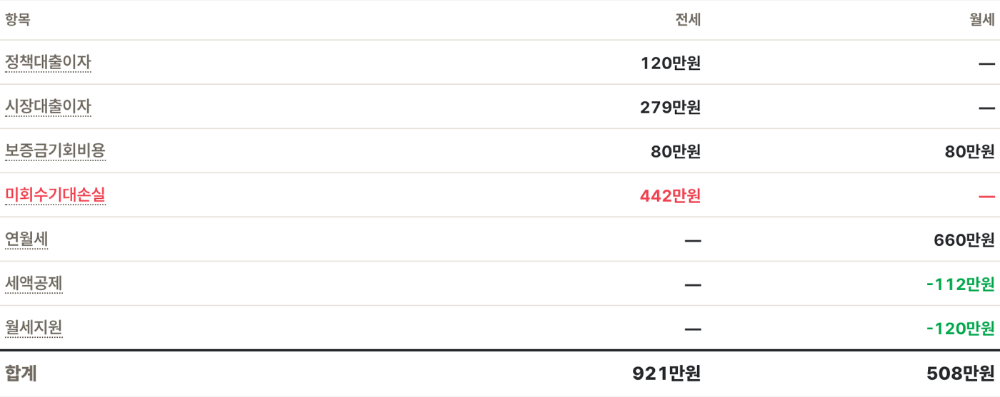
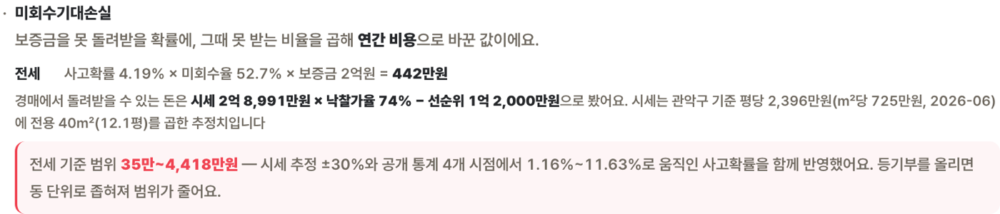
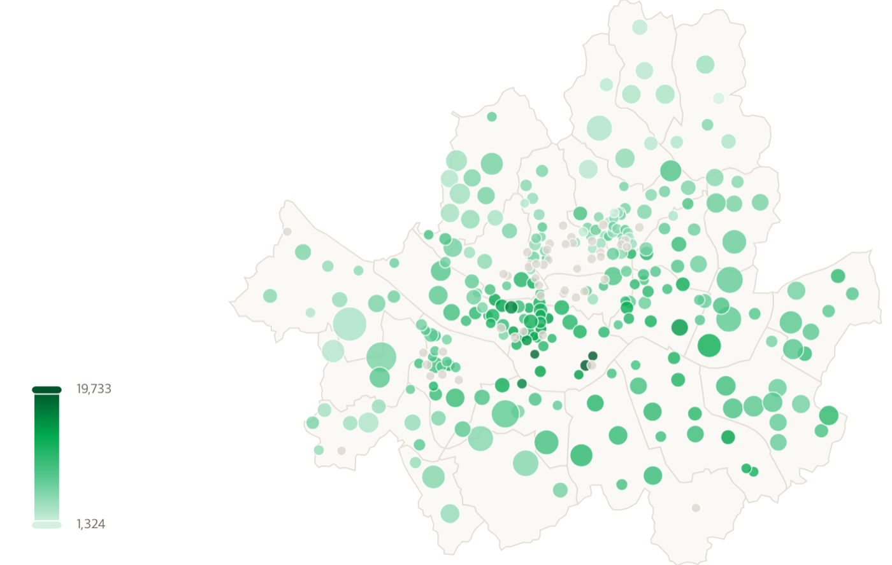
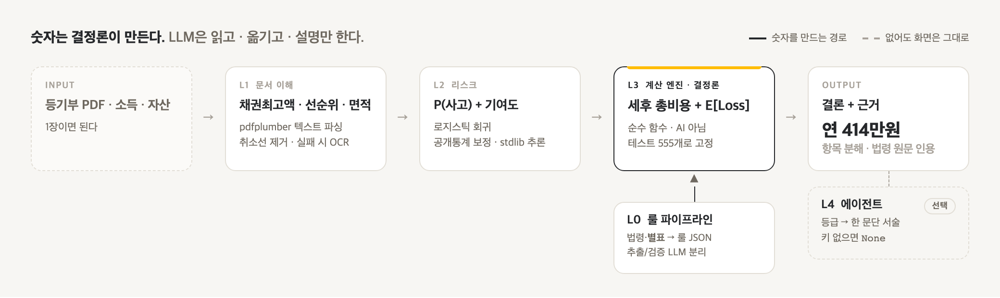

<p align="center">
  <picture>
    <source media="(prefers-color-scheme: dark)" srcset="docs/screenshots/banner-dark.png">
    
  </picture>
</p>

<p align="center">
  <b>이 집, 위험을 감안하면 전세가 월세보다 정말 싼가?</b><br/>
  등기부 위험 스캔 · 리스크 조정 세후 총비용 · 청년 금융지원 자격 판정
</p>

<p align="center">
  
  
  
  
  
</p>

<p align="center"><sub>KB Future Finance A.I. Challenge 출품작</sub></p>

---

## 📌 소개

<b>온전(穩全)</b>은 등기부등본을 읽어 보증금 미회수 위험을 **원(₩) 단위 기대손실**로 환산하고, 전세·월세·매수의 리스크 조정 세후 총비용을 비교하는 청년 주거 금융 의사결정 서비스입니다.

기존 리스크 진단은 `위험도 — 주의` 같은 정성 등급에서 멈춥니다. 등급을 받아도 계약할지는 여전히 본인 몫입니다. 온전은 그 등급을 **금액**으로 바꿔서, 전세와 월세를 같은 자로 잽니다.

<p align="center">
  
</p>

<p align="center">
  혜택만 반영하면 전세가 연 <b>29만원 싸지만</b>, 미회수 기대손실을 얹으면 결론이 뒤집혀 연 <b>414만원 비쌉니다.</b>
</p>

<details>
<summary>이 숫자를 만든 조건 — 2026-08-01 배포 경로 실측</summary>

<br/>

관악구 빌라 · 전용 40㎡ · 전세 2억 / 월세 보증금 2,000만 + 월 55만 · 선순위 채권최고액 1.2억 · 4년 거주 · 만 27세 · 월소득 280만 · 보유자산 2,000만.
시세는 국토부 실거래 캐시의 관악구 평당가(2,396만원, 2026-06)로 추정.

</details>

---

## ✨ 무엇이 다른가

|  | 기존 리스크 진단 | **온전** |
|---|---|---|
| **출력** | 위험도 — 주의 | 미회수 기대손실 **연 442만원** |
| **형태** | 정성 등급 | 원(₩) 금액 |
| **다음 행동** | 계약할지는 본인 몫 | 전세·월세 중 **어느 쪽이 얼마나 유리한지** |
| **불확실성** | 등급 하나 | 범위 + 무엇이 흔들리면 뒤집히는지 |
| **근거** | 대체로 비공개 | 계산식 · 요율 · **법령 원문**을 화면에 |

---

## 🖥️ 화면

### 💰 전세 vs 월세 — 결론과 항목별 분해



전세를 비싸게 만든 것은 대출이자가 아니라 **미회수 기대손실 442만원** 한 줄입니다. 그 줄이 없으면 전세가 이깁니다.

- 조건을 넣으면 **리스크 조정 연비용**을 전세·월세로 나눠 비교
- **적정 주거비(RIR)** 진단 + 받을 수 있는 **청년 금융지원** 추천
- 자격 미달이면 **어느 조항에서 얼마 초과인지 반증**까지 제시
- 등기부 PDF를 올리면 지역·유형·전용면적·선순위 채권최고액을 **자동 채움**
- 금액 칸은 `1억 2천 3백만원`처럼 한글 단위로 입력 가능

### 🔍 근거 — 계산식과 법령 원문



$$E[Loss] = P(사고) \times LGD \times 보증금$$

회수 예상액은 `시세 × 낙찰가율 − 선순위`로 계산하고, 쓰인 시세·낙찰가율·선순위를 전부 화면에 답니다.

> [!NOTE]
> **범위를 내는 이유.** 점추정 하나만 내면 "어느 시점 기준이냐"가 숨습니다.
> 모르는 것을 아는 척하지 않는 편이, 틀린 확신을 주는 것보다 낫다고 봤습니다.

### 🗺️ 동네 지도 — 법정동별 평당가



- 색이 진할수록 비싸고, 원이 클수록 거래가 많습니다
- 동네 간 가격 차가 10배를 넘어 **색은 로그 눈금** — 선형이면 최고가 몇 곳이 스케일을 독점합니다
- 거래 5건 미만인 동은 평균 대신 **회색**으로 두고 건수만 표시
- 버블을 누르면 그 동네, 구 경계를 누르면 그 구의 시세 흐름 차트가 열립니다

---

## 📐 아키텍처

<p align="center">
  <picture>
    <source media="(prefers-color-scheme: dark)" srcset="docs/screenshots/arch-dark.png">
    
  </picture>
</p>

가운데 굵은 상자 하나만 숫자를 만듭니다. **L3는 순수 함수고 AI가 아닙니다** — 의도된 설계입니다. 금융에서 숫자가 틀리면 안 되므로 재현되지 않는 것에 계산을 맡기지 않습니다. 점선으로 매달린 **L4는 꺼져도 됩니다** — 키가 없거나 공개 배포면 `None`이 오고 문단만 빠집니다.

| 계층 | 하는 일 | 구현 |
|:---:|---|---|
| **L0** | 법령·공고 → 자격요건 JSON 룰 DB | 법제처 API(조문·**별표**) + 사람 검수. 오프라인 |
| **L1** | 등기부 PDF → 채권최고액·선순위·면적 | pdfplumber 텍스트 파싱 + 취소선 제거, 실패 시 OCR 폴백 |
| **L2** | 사고확률 P(사고) + 기여도 분해 | 로지스틱 회귀. 공개통계 집계 마진 보정, 추론은 stdlib |
| **L3** | 세후 총비용 + E[Loss] + 등기부 등급 | 순수 함수. **AI 아님 — 의도된 설계** |
| **L4** | 해석 문단, what-if 번역 | LLM(Gemini). 실패하면 `None`이고 화면은 그대로 |

> [!IMPORTANT]
> L1은 비전 LLM이 아닙니다. 원안([docs/design.md](docs/design.md))엔 그렇게 적혀 있지만 구현은 텍스트 파싱입니다.
> 계획과 구현이 갈라진 지점 전체는 [docs/architecture.md](docs/architecture.md) §1 표에 있습니다.

---

## 🏗️ 기술 스택

| 영역 | 기술 |
|---|---|
| **백엔드** | FastAPI + Uvicorn (`api/main.py` — 시세·지도·등기부·의사결정 4개 엔드포인트) |
| **프론트엔드** | React 19 + Vite 8 + ECharts 6 (`web/`) |
| **문서 파싱** | pdfplumber (텍스트 레이어) · pypdfium2 + pytesseract (스캔본 OCR 폴백) |
| **리스크 모델** | 로지스틱 회귀 — 공개통계 집계 마진 보정. 추론은 **stdlib `math.exp`만** |
| **계산 엔진** | Python 순수 함수 — pandas·numpy 미사용 |
| **LLM** | Google Gemini 2.5 Flash (선택 경로) · Anthropic 폴백 |
| **캐시** | SQLite (WAL) — 국토부 실거래 캐시 |
| **룰 DB** | 버전 태그 JSON (`YYYY-MM`) — 세제·시장·낙찰가율·금리·상품·등기부권리 |
| **테스트** | pytest 576개 |

### 데이터 출처

| 출처 | 쓰는 곳 |
|---|---|
| **국토교통부** 실거래가 | 시세 추정, 평당가 차트, 동네 지도 (아파트·연립다세대·오피스텔·단독다가구 × 매매·전월세) |
| **법제처** 국가법령정보 | 취득세·중개보수·세액공제 조문 및 **별표** 원문 |
| **금융감독원** Finlife | 전세자금대출 공시 상품명·금리 |
| **한국주택금융공사** | 전세대출 **실행금리** 금액가중평균 |
| **한국부동산원** 부동산테크 | 리스크 모델 보정 (시군구×주택유형 920관측, 4개 시점) |

---

## 📁 프로젝트 구조

```
onjeon/
├── api/main.py               # 배포 REST 계층 + web/dist 서빙 (단일 포트)
├── web/                      # 배포 프론트 (React + Vite)
│   └── src/
│       ├── Decision.jsx      # 전세 vs 월세 진단 화면 (메인)
│       ├── App.jsx           # 시세 흐름 차트
│       ├── MarketMap.jsx     # 동네 지도 (법정동 버블)
│       └── money.js          # 한글 금액 입력 파서
├── src/onjeon/
│   ├── decision.py           # 배포 의사결정 오케스트레이터
│   ├── l0/rule_pipeline.py   # 공고 → 룰 JSON (추출/검증 LLM 분리 강제)
│   ├── l1/                   # 스키마 게이트 + 등기부 파서
│   ├── l2/model.py           # 로지스틱 회귀 P(사고) + 기여도
│   ├── l3/
│   │   ├── engine.py         # 세후 비용 · LGD · 구간표 요율
│   │   ├── risk.py           # 보증금 미회수 위험의 단일 정의
│   │   ├── register_risk.py  # 등기부에 적힌 권리 제한 → 등급
│   │   ├── eligibility.py    # 정책상품 자격 판정 + 미자격 반증
│   │   ├── affordability.py  # 적정 주거비(RIR) 진단
│   │   └── recommend.py      # 상품 랭킹
│   ├── l4/
│   │   └── register_explain.py  # 등급 → 한 문단 (선택 경로, 실패 시 None)
│   ├── register/parse.py     # 등기부 PDF 파싱 (취소선·전유부분·층별면적)
│   ├── market/               # 시세 집계·지도·캐시
│   └── rules/                # 버전 태그 룰 JSON (YYYY-MM)
├── scripts/                  # 데이터 수집 · 캐시 워밍 · 모델 보정
├── tests/                    # pytest 576개
├── docs/                     # 문제 정의 · 아키텍처 · 설계 · 데이터 파이프라인
├── dev.sh serve.sh tunnel.sh # 개발 / 로컬 프로덕션 / 공개 시연
└── Dockerfile render.yaml    # 컨테이너 배포 폴백
```

---

## 🔑 핵심 모듈 설명

### `l3/risk.py` – 보증금 미회수 위험의 **단일 정의**
- `P(사고) → LGD → E[Loss]`를 여기서만 계산합니다
- `compare.py`와 `decision.py` 둘 다 이 모듈을 씁니다 — 위험의 두 번째 정의를 만들지 않기 위해서입니다
- 시세 추정 ±30%와 사고확률 4개 시점을 함께 반영한 **범위**를 함께 냅니다

### `l3/engine.py` – 세후 비용과 구간표 요율
- 전세·월세·매수의 연간 실질비용, `lgd()`(회수 예상액 → 손실률)
- `bracket_fee()`가 룰 JSON의 **구간표**를 읽는 단일 경로입니다 — 취득세(지방세법 §11①8호 3구간)와 중개보수(공인중개사법 시행규칙 별표 1)
- 단일 요율로 두면 어느 구간에서든 조용히 틀립니다 (7억 매물에서 연 128만원 차이)

### `register/parse.py` – 등기부 PDF 파싱
- **취소선(도형)과 순위번호 참조** 두 경로로 말소 기록을 제외합니다 — 텍스트만 읽으면 말소된 근저당이 유효한 것과 섞입니다
- 집합건물 전용면적은 `전유부분` 절만 잘라 읽습니다 (대지면적·대지권비율과 구분)
- 건물 등기부(다중·다가구)는 층별 면적이 여러 줄이라 **자동 채움을 하지 않습니다**
- 용도가 두 개 적힌 건물(근린생활시설 + 주택)은 그 호수가 어느 쪽인지 문서에 없으므로 **고르지 않고 경고합니다** — 근생이면 주택임대차보호법의 대항력·최우선변제가 달라집니다
- 텍스트 레이어가 없으면 OCR 폴백 (렌더 배율 3)

### `l3/register_risk.py` – 등기부에 **적힌** 권리 제한
- 가압류·경매개시·신탁 등을 룰 테이블로 등급화합니다
- `risk.py`와 **다른 축**입니다 — 🟢여도 전세가율이 높으면 E[Loss]는 큽니다

### `decision.py` – 배포 의사결정 오케스트레이터
- 전세 vs 월세 리스크 조정 비교 + RIR 진단 + 금융지원 추천을 묶습니다
- 판단값(`judgment`)에 **오차 방향**을 붙여 화면에 그대로 노출합니다

---

## 🚀 시작하기

### 사전 요구사항

- **Python** 3.12 이상 · [uv](https://github.com/astral-sh/uv)
- **Node.js** 20 이상 (Vite 8 요구사항)
- **tesseract** (스캔 등기부 OCR 폴백 — 없으면 텍스트 PDF만 처리)

### 설치

```bash
git clone https://github.com/Daegyu519/onjeon.git
cd onjeon

uv venv --python 3.12 .venv
uv pip install -p .venv -e ".[dev,llm]"
( cd web && npm ci )

cp .env.example .env
```

### 환경 변수 설정 (.env)

| 변수 | 설명 | 발급처 |
|---|---|---|
| `MOLIT_API_KEY` | 국토부 실거래가 — **없으면 시세가 비어 있습니다** | [공공데이터포털](https://www.data.go.kr/) |
| `FSS_API_KEY` | 금감원 Finlife 공시금리 (선택) | [금융상품 한눈에](https://finlife.fss.or.kr/) |
| `GEMINI_API_KEY` | 등기부 설명 문단 · what-if 질의 (선택) | [Google AI Studio](https://aistudio.google.com/) |
| `ANTHROPIC_API_KEY` | Gemini 폴백 (선택) | [Anthropic Console](https://console.anthropic.com/) |
| `ONJEON_NGROK_DOMAIN` | 공개 시연용 고정 도메인 (선택) | [ngrok](https://dashboard.ngrok.com/) |

> [!NOTE]
> LLM 키가 없어도 앱은 정상 동작합니다. 설명 문단만 빠지고 **숫자와 판정은 그대로**입니다 — L4는 전부 선택 경로입니다.

### 실행

```bash
.venv/bin/python -m pytest        # 전체 테스트 576개
```

| 목적 | 명령 | 접속 |
|---|---|---|
| **개발** (핫리로드) | `./dev.sh` | http://localhost:5180 · API 문서 `:8000/docs` |
| **로컬 프로덕션** | `./serve.sh` | http://localhost:8000 |
| **외부 공개** (시연·심사) | `./tunnel.sh` | 고정 URL — `./tunnel.sh url` 확인, `stop` 종료 |

### 시세 캐시 워밍

`./tunnel.sh`는 **읽기 전용**으로 뜹니다(`ONJEON_PUBLIC_READONLY=1`). 인증 없는 공개 경로가 국토부 API를 직접 타면 1요청이 최대 183회 호출을 유발해, 누구나 운영자의 실명 인증 서비스키 쿼터를 소진시킬 수 있기 때문입니다.

```bash
.venv/bin/python scripts/warm_cache.py --regions 관악구 강남구 --types rh apt --period 1y
.venv/bin/python scripts/geocode_dongs.py     # 동네 지도 좌표 (서울 417개, 약 8분)
```

예상 호출량을 먼저 출력하고 1,000회를 넘으면 `--yes` 없이는 거절합니다.

> [!WARNING]
> **`./tunnel.sh`는 시연할 때만 켜세요.** 고정 주소는 곧 영구히 발견 가능한 주소이고,
> 이 터널 뒤에 있는 건 `.env`에 실제 API 키가 로드된 개인 컴퓨터입니다(앱에 인증 계층 없음).

---

## 🎨 디자인 시스템

KB국민은행 팔레트 기반. 대비비는 실측값이며 전부 WCAG AA를 통과합니다.

| 요소 | 값 | 비고 |
|---|---|---|
| **Brand** | `#FFBC00` | KB 옐로우 — 주요 행동·선택됨. 면적을 작게 유지 |
| **Brand ink** | `#26282B` | 옐로우 위 글자. **흰 글씨는 1.69:1로 못 씁니다** |
| **Accent** | `#60584C` | KB 그레이 — 포커스·활성 테두리 (7.0:1) |
| **Text** | `#26282B` | 웜 잉크 — 카드 대비 14.8:1 |
| **Text 2** | `#6F6960` | 보조 텍스트 (5.4:1) |
| **배경 / 카드** | `#F7F6F3` / `#FFFFFF` | 웜 페이퍼 |
| **Border** | `#E7E3DB` | |
| **매매 / 전세** | `#00A84D` / `#0066FF` | 차트 계열색 |
| **상승 / 하락** | `#F04452` / `#3182F6` | 한국 관례 — 상승이 빨강 |
| **서체** | Pretendard → Apple SD Gothic Neo | 숫자는 `tnum` 고정폭 |

---

## 📚 문서 안내

| 문서 | 내용 | 이런 질문에 답함 |
|---|---|---|
| [docs/summary.md](docs/summary.md) | **과제 요약** — 제출·발표용 (150자/400자/전문) | "이 과제가 뭔데?" |
| [CLAUDE.md](CLAUDE.md) | 프로젝트 원칙·구조·컨벤션 + **실측 함정 13건** | "이 프로젝트의 규칙은?" |
| [docs/problem.md](docs/problem.md) | 문제 정의 — 가치·경쟁·범위 밖·한계 | "왜 이걸 만드는가? 뭘 안 푸는가?" |
| [docs/architecture.md](docs/architecture.md) | **as-built** 설계도 — 계층별 실제 구현 | "지금 실제로 어떻게 돌아가는가?" |
| [docs/design.md](docs/design.md) | 원안(2026-07-19) — 모듈 스펙, 수식, 스키마 | "무엇을 만들 **계획**이었나?" |
| [docs/workflow.md](docs/workflow.md) | 4주 MVP 계획, 역할 분담, 데모 시나리오 | "누가 언제 무엇을 하는가?" |
| [docs/data-pipeline.md](docs/data-pipeline.md) | 외부 데이터 출처·수집 스크립트·갱신 주기 | "데이터는 어디서 어떻게 채우는가?" |

---

## ⚠️ 한계와 남은 작업

> [!CAUTION]
> **서울 25개 구만 다루고, 그 밖의 지역은 계산을 막습니다.** 실거래가를 서울만 모았고
> 소액임차인 최우선변제도 시행령 §10·§11의 서울 구간만 넣었습니다. 근거가 반쪽인 결론을
> 내놓는 것보다 낫다고 봤습니다.

- **등기부에 안 적히는 위험은 못 봅니다** — 임대인의 국세 체납, 다가구주택의 선순위 임차인
- **집계 마진 보정에는 생태학적 오류가 있습니다** — 지역 평균 계수를 개별 매물에 적용합니다
- **보증에 가입한 매물만 잡힌 통계**라 실제 위험은 이보다 클 수 있습니다
- **다중주택은 면적 입력이 결론을 바꿉니다** — 방 20㎡ 기준 기대손실 6,831만원, 건물 연면적
  기준 0원. 등기부에 방 면적이 없어 사용자가 넣습니다. 보수적인 쪽을 쓰고 경고를 붙입니다
