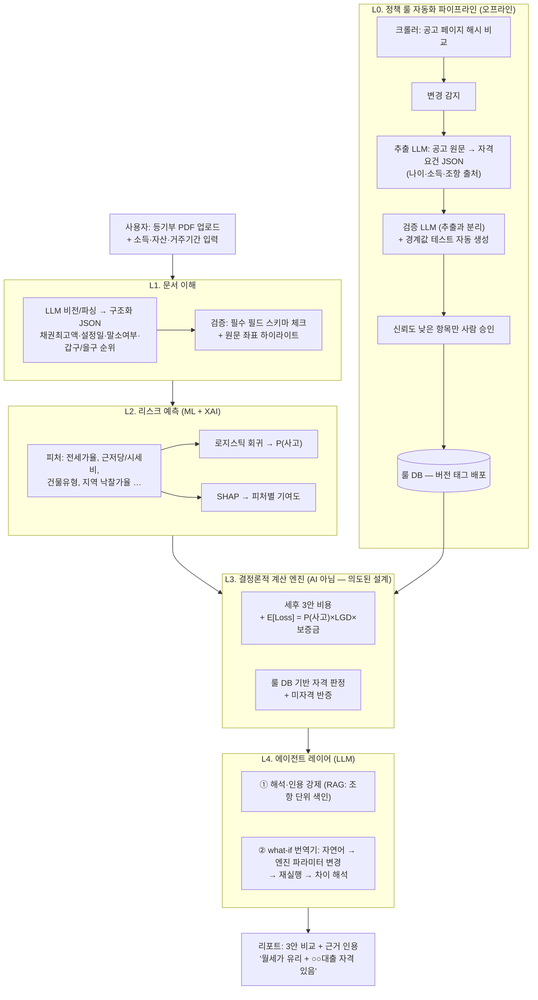

# 아키텍처 — 5계층 AI 시스템

> 사분면: Explanation + Reference. "시스템이 왜 이렇게 나뉘고, 각 계층은 정확히 무엇을 하는가"에 답한다.
> 상세 모듈 스펙·스키마는 [design.md](design.md), 구현 일정은 [workflow.md](workflow.md) 참조.

## 문제: LLM에게 금융 계산을 맡길 수 없다

금융 서비스에서 숫자가 틀리면 신뢰가 무너진다. LLM은 문서를 읽고 설명하는 데 강하지만, 세후 비용 계산이나 자격 판정 같은 결정적(deterministic) 연산에서 오차를 낼 수 있다. 동시에 등기부등본 파싱이나 정책 공고 해석은 규칙 기반 코드로는 커버할 수 없는 비정형 문서 이해 문제다.

**해법: AI를 세 겹으로 쓴다 — 문서를 읽는 AI(L1), 위험을 예측하는 AI(L2), 규칙을 쓰고 조작하는 AI(L0/L4). 계산만은 결정론(L3)으로 남겨둔다.**

## 전체 구조

## 계층별 책임 (Reference)

### L0. 정책 룰 자동화 파이프라인 (오프라인, 룰 DB 공급)

| 항목 | 내용 |
|---|---|
| 입력 | 정책상품 공고 원문 (웹 페이지 / PDF) |
| 출력 | 자격요건 JSON (나이·소득·자산 조건 + 조항 출처), 버전 태그 |
| 처리 | 크롤러(공고 페이지 해시 비교) → 변경 감지 → 추출 LLM → 검증 LLM + 경계값 테스트 → 저신뢰 항목만 사람 승인 → 배포 |
| 핵심 제약 | **추출 LLM과 검증 LLM은 반드시 분리.** 경계값 테스트 통과 전에는 룰 DB 반영 금지 |
| 존재 이유 | 정책상품 100여 개가 수시로 바뀜 — "정책이 바뀌어도 DB를 사람이 다시 짜지 않는다" |

### L1. 문서 이해

| 항목 | 내용 |
|---|---|
| 입력 | 등기부등본 PDF (사용자 업로드) |
| 출력 | 구조화 JSON: 채권최고액, 근저당 설정일, 말소 여부, 선순위 임차권, 압류·가압류, 소유권 변동 이력, 갑구/을구 순위 |
| 처리 | LLM 비전/파싱 → JSON → 필수 필드 스키마 검증 |
| 핵심 제약 | 모든 추출 값에 **원문 좌표(등기부 내 위치)를 함께 저장**해 하이라이트·인용 가능해야 함 |

### L2. 리스크 예측 (ML + XAI)

| 항목 | 내용 |
|---|---|
| 입력 | 피처: 전세가율, 근저당/시세 비율, 건물유형(빌라 가중), 지역·유형별 낙찰가율, 임대인 다주택·체납 신호(확인 가능 범위 내) |
| 출력 | P(사고) — 매물별 보증사고 확률, SHAP 피처별 기여도 ("위험 ↑ 요인: 전세가율 +0.12, 근저당비율 +0.08") |
| 모델 | 로지스틱 회귀 (풀 버전: XGBoost + KB 내부 데이터) |
| 핵심 제약 | 설명 가능성(XAI)이 성능보다 우선. 데모는 합성+공개 데이터 — **구조 시연 목적임을 명시** |

### L3. 결정론적 계산 엔진 (AI 아님 — 의도된 설계)

| 항목 | 내용 |
|---|---|
| 입력 | L1 파싱 결과 + L2 P(사고) + 사용자 변수(소득·자산·거주 예정 기간) + 룰 DB |
| 출력 | 전세/월세/매수 3안 세후 총비용, E[Loss], 정책상품 자격 판정 + 미자격 반증 |
| 처리 | 순수 Python 함수 (단위 테스트 필수). 수식은 [design.md §기대손실 수식](design.md#기대손실-수식) |
| 핵심 제약 | LLM 호출 금지. 모든 세제·상품 규칙은 룰 DB(버전 태그 JSON)에서 읽는다 |

### L4. 에이전트 레이어 (LLM)

| 항목 | 내용 |
|---|---|
| 입력 | L3 계산 결과 + 사용자 자연어 질의 |
| 출력 | 해석 리포트(조항 단위 인용 강제), what-if 응답 |
| 처리 | ① RAG 기반 해석·인용 ② what-if 번역기: "연봉 500 오르면?" → 엔진 파라미터 변경 → L3 재실행 → 차이 해석 |
| 핵심 제약 | **LLM은 계산하지 않고 조작만 한다.** function calling으로 L3를 tool로 등록 |

## 설계 결정과 트레이드오프 (Explanation)

### 왜 계산을 결정론으로 분리했나

- **얻는 것**: 숫자의 재현성·검증 가능성(단위 테스트), 법적 책임 방어("판정 결정론화 + 원문 인용"), 심사위원 신뢰
- **버리는 것**: 세제 커버리지 확장 시 룰 DB·코드를 함께 유지보수해야 하는 비용. LLM에 다 맡기면 개발은 빠르지만 오답 위험을 감수해야 함 — 금융에서는 수용 불가

### 왜 로지스틱 회귀인가 (XGBoost가 아니라)

- 데모 단계의 목적은 **성능 수치가 아니라 "모델 구조와 설명 체계"** 를 보여주는 것. 로지스틱 회귀 + SHAP은 계수 해석이 투명하고 합성 데이터 수백 건으로도 구조 시연 가능
- 풀 버전은 KB 내부 전세대출·보증사고 데이터 결합 시 XGBoost로 고도화 — 이것이 KB 도입 논거(B2B: 심사 참고지표 → 사고율·회수율 개선)

### 왜 룰을 데이터로 분리했나

- 세법(조특법 §95-2 등)·정책상품 요강은 매년 바뀐다. 코드에 하드코딩하면 변경마다 재배포·재검증 필요
- JSON 룰 DB + 버전 태그("2026년 ○월 기준")로 분리하면 L0 파이프라인이 자동 갱신하고, 판정 근거를 조항 단위로 인용 가능

### 추출↔검증 분리의 이유

- 같은 LLM이 추출하고 검증하면 동일한 오독을 반복한다. 별도 검증 LLM + 자동 생성 경계값 테스트(예: "만 34세는 통과, 만 35세는 탈락")로 교차 검증하고, 신뢰도 낮은 항목만 사람 승인 큐로 보낸다

## 수상작 계보 (선례 근거)

- 2025 「규제 준수 모니터링 에이전트」 = L0의 선례
- 2025 「설명 가능한 신용 위험」, 2021 「XAI 대출심사」 = L2의 선례
- 2022 「전세사기 예방 OCR」 = L1의 전신

## 관련 문서

- 모듈별 상세 스펙·수식·스키마 → [design.md](design.md)
- 레이어별 데모 구현 범위(풀 버전 vs 4주 데모) → [workflow.md](workflow.md)
- 프로젝트 원칙 → [CLAUDE.md](../CLAUDE.md)
