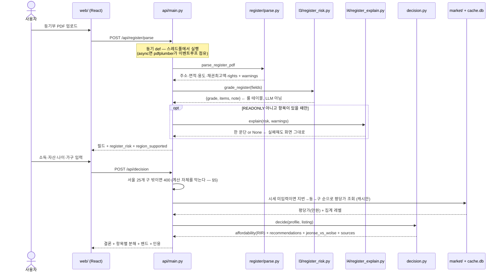

# 설계도 — 온전(穩全)이 실제로 어떻게 조립돼 있는가

> 사분면: Explanation + Reference. **이 문서는 as-built다** — 계획이 아니라 지금 돌아가는 것을 적는다.
> "무엇을 만들 계획이었나"는 [design.md](design.md), "왜 이 문제인가"는 [problem.md](problem.md),
> 일정·역할은 [workflow.md](workflow.md).
> 기준: 2026-08-01 · 테스트 555개 통과 · 배포 경로 3종.

---

## 0. 한 장 요약

등기부 PDF 한 장과 소득·자산 몇 줄을 받아, **"이 집, 위험을 감안하면 전세가 월세보다 정말 싼가"**에
원(₩) 단위로 답한다. 답의 모든 숫자는 결정론 코드가 만들고, LLM은 그 숫자를 만지지 않는다.

```
등기부 PDF ─┬─→ [L1] 텍스트 파싱(pdfplumber) ─→ 실패 시 OCR(tesseract) ─→ 필드 + 사유
            │       주소·전용면적·용도·채권최고액·권리제한
            │
            ├─→ [L3-a] register_risk: 등기부에 **적힌** 권리제한 → 등급 🟢🟡🔴
            │       (룰 테이블 lookup. 선택적으로 L4가 한 문단 설명을 붙인다)
            │
            └─→ [시세] 국토부 실거래 캐시 평당가 × 전용면적 → 예상 매매가(+밴드)
                        ↓
사용자 입력 ──────→ [L2] P(사고) ─┐
(소득·자산·나이·가구)              ├─→ [L3-b] E[Loss] = P × LGD × 보증금
                  [룰 DB] ────────┤        LGD = 1 − (예상낙찰가 − 선순위 + 최우선변제)/보증금
                  (세제·금리·낙찰가율·상품)     ↓
                                  └─→ [L3-c] 전세 vs 월세 연비용 + RIR + 자격판정/미자격 반증
                                             ↓
                                          결론 + 항목별 분해 + 조항 인용
```

---

## 1. 계층 정의와 **실제 구현** (계획 대비)

계획서(design.md, 2026-07-19)와 구현이 갈라진 지점을 숨기지 않는다. 왼쪽이 계획, 오른쪽이 현물이다.

| 계층 | 계획 | **실제 구현** | 왜 갈라졌나 |
|---|---|---|---|
| **L0** 룰 파이프라인 | 크롤러 → 추출 LLM → 검증 LLM → 룰 DB 자동 배포 | `l0/rule_pipeline.py`(추출/검증 분리 강제)는 있으나 **자동 크롤링은 미가동**. 실제 룰은 `scripts/fetch_law_clauses.py`(법제처 API 조문·**별표**)로 원문을 받아 사람이 검수해 JSON에 넣는다 | 요율이 조문이 아니라 **별표**에 있어서(함정 8) 범용 크롤러로는 틀린 값이 들어온다. 원문 줄을 룰에 남기고 대조하는 쪽이 안전 |
| **L1** 문서 이해 | 비전 LLM으로 PDF 파싱 | **비전 LLM 아님.** `register/parse.py`가 pdfplumber 텍스트 파싱, 실패 시에만 tesseract OCR 폴백 | 정확도·비용·재현성 전부 텍스트 파싱이 이겼다. 등기부는 고정 양식이고, LLM은 숫자를 조용히 바꾼다(원칙 1) |
| **L2** 리스크 예측 | 합성/내부 데이터로 로지스틱 회귀 **학습** + SHAP | **학습하지 않는다.** `scripts/calibrate_risk_model.py`가 부동산테크 시군구 공개통계(920관측·4시점)로 계수를 **보정**하고, 추론은 `math.exp` 한 줄(stdlib). 시점별 계수로 P의 **밴드**를 낸다 | 학습할 라벨 데이터가 없다. 그리고 배포 컨테이너엔 numpy/pandas/sklearn이 없다(함정 2) |
| **L3** 계산 엔진 | 3안(전세·월세·매수) 세후 비용 + E[Loss] | 그대로. 다만 **주업무가 전세 vs 월세 2안**으로 좁혀졌고 매수는 시세가 있을 때만 곁다리로 붙는다. `register_risk.py`(권리제한 등급)가 **별도 축**으로 추가됐다 | 매수는 청년 페르소나에서 현실 선택지가 아니었다. 등기부에 '적힌' 위험은 확률과 다른 종류라 섞을 수 없다(§3) |
| **L4** 에이전트 | RAG 인용 + what-if 자연어 재계산 | 배포 경로엔 **`register_explain.py` 하나뿐**(등급 → 한 문단, Gemini, 실패하면 `None`). what-if 에이전트(`l4/agent.py`)와 RAG는 `app.py`(Streamlit) 전용 — **배포 미포함** | 인용은 룰 JSON의 `clause`로 충분했다(코퍼스 2.8KB). LLM이 없어도 제품이 완전히 돌아가는 쪽을 택했다 |
| **UI** | Streamlit | **React + Vite + ECharts**(`web/`), FastAPI가 `web/dist`까지 단일 포트로 서빙. Streamlit은 연구용으로만 잔존 | 심사·시연에서 Streamlit의 렌더 지연과 상태 초기화가 치명적이었다 |

### 이 표에서 읽어야 할 것

**AI를 줄이는 방향으로 갈라졌다.** 계획은 5계층 전부에 LLM을 붙였고, 구현은 L1·L2에서 LLM을
걷어냈다. 남은 LLM은 두 곳뿐이고(L0 검수 보조, L4 문단 설명) **둘 다 꺼도 제품이 답을 낸다.**
이건 후퇴가 아니라 원칙 1("LLM은 계산하지 않는다")을 끝까지 밀었을 때 도달하는 지점이다.

---

## 2. 배포 경로의 데이터 흐름 (실제 호출 순서)

엔드포인트는 4개다(`api/main.py`). 화면이 이 순서로 부른다.


```mermaid
sequenceDiagram
    actor U as 사용자
    participant W as web/ (React)
    participant A as api/main.py
    participant P as register/parse.py
    participant G as l3/register_risk.py
    participant E as l4/register_explain.py
    participant D as decision.py
    participant M as market/ + cache.db

    U->>W: 등기부 PDF 업로드
    W->>A: POST /api/register/parse
    Note over A: 동기 def — 스레드풀에서 실행<br/>(async면 pdfplumber가 이벤트루프 점유)
    A->>P: parse_register_pdf
    P-->>A: 주소·면적·용도·채권최고액·rights + warnings
    A->>G: grade_register(fields)
    G-->>A: {grade, items, note}  ← 룰 테이블, LLM 아님
    opt READONLY 아니고 항목이 있을 때만
        A->>E: explain(risk, warnings)
        E-->>A: 한 문단 or None  ← 실패해도 화면 그대로
    end
    A-->>W: 필드 + register_risk + region_supported

    U->>W: 소득·자산·나이·가구 입력
    W->>A: POST /api/decision
    A->>A: 서울 25개 구 밖이면 400 (계산 자체를 막는다 — §5)
    A->>M: 시세 미입력이면 지번→동→구 순으로 평당가 조회 (캐시만)
    M-->>A: 평당가(만원) + 집계 레벨
    A->>D: decide(profile, listing)
    D-->>A: affordability(RIR) + recommendations + jeonse_vs_wolse + sources
    A-->>W: 결론 + 항목별 분해 + 밴드 + 인용
```

**주의 지점 3개** (전부 실측으로 배운 것):

1. `/api/register/parse`는 **`async def`가 아니다.** 동기 함수여야 FastAPI가 스레드풀로 보낸다.
   `async def`로 두면 pdfplumber·tesseract가 이벤트 루프를 잡아 업로드 1건이 다른 방문자의
   시세 조회까지 멈춘다(50MB 실측 73초 전면 정지).
2. 시세 추정은 **`mae_level`을 본다** — 차트용 `level`은 전세·월세 거래도 세므로, 그걸 밴드에
   쓰면 매매 거래가 거의 없는 건물이 '건물 단위 정밀도'를 주장하게 된다.
3. 시세는 **매매(mae) 평당가만** 쓴다. 경매 회수는 매매 시세 기준이라 전세 평당가를 넣으면
   LGD가 무의미해진다.

---

## 3. 설계의 급소 — 위험을 **두 축**으로 나눈 것

이 프로젝트에서 가장 되돌리기 어려운 결정이다.

| | **축 A — 확률적 위험** | **축 B — 기재된 위험** |
|---|---|---|
| 모듈 | `l3/risk.py` (+ `l2/model.py`) | `l3/register_risk.py` |
| 질문 | "이 조건에서 보증금을 못 받을 확률과 금액은?" | "이 등기부에 이미 적혀 있는 적신호는?" |
| 입력 | 전세가율·근저당비율·건물유형·낙찰가율 | 가압류·경매개시·신탁·압류 등 권리 제한 |
| 출력 | P(사고), LGD, **E[Loss] 원(₩)** + 밴드 | 등급 🟢🟡🔴 + 항목별 사유 |
| 성격 | 통계적 추정 (틀릴 수 있음, 밴드로 고백) | 문서 사실 (읽었거나 못 읽었거나) |

**왜 합치지 않았나.** 두 축은 서로 독립이다 — 갑구·을구가 깨끗한 🟢 매물이라도 전세가율이
90%면 E[Loss]는 크고, 반대로 가압류가 붙은 🔴 매물이 보증금이 작아 E[Loss]는 작을 수 있다.
한 모듈에 섞으면 **위험의 두 번째 정의**가 생기고, 화면은 둘을 하나의 '위험도'로 뭉개서
보여주게 된다. 그 순간 사용자는 🟢을 "안전하다"로 읽는다 — 이 제품이 반박하려는 바로 그
오해다.

**모르는 것을 🟢으로 내보내지 않는다.** OCR이거나 채권최고액을 못 읽은 상태에서 아무 항목도
안 잡혔다면 그건 "권리 제한이 없다"가 아니라 "못 봤다"다 → `unknown`. 반대로 저신뢰
상태에서도 가압류가 **잡혔다면** 등급을 내리지 않는다(진짜 적신호를 '판정 보류'에 묻지 않는다).

---

## 4. 결정론 / LLM 경계 — 어디까지가 코드인가

```
┌─ 결정론 (테스트로 고정, 555개) ──────────────────────────────┐
│  파싱  register/parse.py      정규식 + pdfplumber 도형(취소선)  │
│  등급  l3/register_risk.py    룰 테이블 lookup                 │
│  확률  l2/model.py            math.exp — 계수는 룰 JSON        │
│  손실  l3/risk.py             P → LGD → E[Loss] 단일 정의      │
│  비용  l3/engine.py           구간표 세율·요율(bracket_fee)     │
│  자격  l3/eligibility.py      field-op-value + 미자격 반증      │
│  적정  l3/affordability.py    RIR                              │
└──────────────────────────────────────────────────────────────┘
        ↑ 여기까지가 답이다. 아래는 있으면 좋은 것.
┌─ LLM (전부 선택적 — 없어도 위 결과가 나온다) ─────────────────┐
│  l4/register_explain.py   등급 → 한 문단. 실패 시 None         │
│  l4/agent.py              what-if 파라미터 조작 (app.py 전용)  │
│  rag/                     조항 검색 (app.py 전용, 배포 미포함) │
│  l0/rule_pipeline.py      공고 → 룰 초안 (오프라인, 사람 검수) │
└──────────────────────────────────────────────────────────────┘
```

`register_explain`의 시스템 프롬프트는 **금지 목록**으로 경계를 강제한다: 등급 변경 금지,
입력에 없는 위험요소 추가 금지, **숫자 생성 금지**(시세·전세가율·사고확률·기대손실 언급 불가),
임대인 신용 추정 금지, 계약 권유·만류 금지.

---

## 5. "모르면 계산하지 않는다" — 거절이 설계의 일부다

이 시스템은 세 곳에서 **답을 내지 않기를 선택한다.** 전부 "틀린 숫자보다 빈칸이 낫다"는 같은 판단이다.

| 상황 | 동작 | 이유 |
|---|---|---|
| 서울 25개 구 밖 | `/api/decision`이 **400**. 업로드 시점에 미리 안내 | 시세 캐시가 서울만 있고, 최우선변제도 시행령 §10·§11의 서울 구간만 반영돼 있다. 두 축이 함께 빈 채로 낸 기대손실은 근거가 없다 |
| 시세 또는 선순위 미상 | E[Loss]를 **0으로 계산하지 않고** `adjusted=False` + 사유 | 0은 화면에서 "위험 없음"으로 읽힌다 |
| 전용면적을 특정 못 함 (건물 등기부·다중주택) | 후보가 1개여도 **자동채움 안 함**, 층별 면적을 라벨과 함께 노출 | 층 면적을 전용면적이라 부르면 시세 과대 → LGD 과소 → **위험한 집이 안전해 보인다** |

방향이 중요하다. 오차를 감수해야 할 때는 **위험을 과대평가하는 쪽**으로 넘어간다
(말소 판단이 애매하면 선순위에서 빼지 않는다 = 위험 과대 = 안전 방향).

---

## 6. 룰은 코드가 아니라 데이터

`src/onjeon/rules/*.json` — 전부 `YYYY-MM` 버전 태그. 로더는 `rules_io`가 단일 경로다.

> ⚠️ **버전 선택은 문자열 정렬의 최댓값이다** — `sorted(glob(f"{name}_*.json"))[-1]`
> ([rules_io.py:16](../src/onjeon/rules_io.py#L16)). 날짜를 이해하지 않는다.
> 그래서 이 폴더엔 **`{name}_YYYY-MM.json` 이외의 파일을 두면 안 된다.**
> `risk_model_backup.json`을 두면 `"backup" > "2026-08"`이라 그게 선택되고,
> `risk_model_2026-9.json`(제로패딩 없음)은 `"2026-9" > "2026-10"`이라 순서가 뒤집힌다.
> 예외도 경고도 없다 — 구버전이 걸리면 `periods`가 비어 **E[Loss] 밴드가 조용히 사라지고**
> 화면엔 점추정만 남는다. 백업은 이 폴더 밖에 둔다.

| 룰 | 내용 | 출처 |
|---|---|---|
| `tax_rules` | 취득세·중개보수·월세세액공제 — **구간표**(`brackets`) | 지방세법 §11, 공인중개사법 시행규칙 **별표 1**, 조특법 §95-2 |
| `market_params` | 금리·기회비용·RIR 상한·최우선변제·시세 불확실성 폭 | 주택임대차보호법 시행령 §10·§11, 한국주택금융공사·금감원 Finlife |
| `auction_rates` | 지역·유형별 낙찰가율 | 법원경매 공개 통계 |
| `risk_model_*` | 로지스틱 계수 + **시점별** 계수(밴드용) | 부동산테크 시군구 공개통계 4시점 |
| `bank_rates` | 은행별 실측 전세대출 금리 | HF 공개 API |
| `register_risk` | 권리제한 유형 → 등급·사유·확인사항 | 판단값(설계) |
| `products/` | 정책상품 자격요건 + `clause_refs` | 기금e든든 등 공고 |

**두 가지 함정이 여기 산다.**
① 요율은 조문이 아니라 **별표**에 있다 — 조문만 받고 2차 출처를 베끼면 매매 중개보수가
0.5%로 들어간다(별표 1의 0.5%는 5천만~2억 구간, 2억~9억은 1천분의 4).
② **단일 요율은 어느 구간에서든 조용히 틀린다.** `engine.bracket_fee`가 구간표를 읽는 단일
경로이고, 테스트 픽스처도 실제 룰과 **같은 구간표 모양**이어야 한다.

---

## 7. 배포 형상 — 경로가 3개, 의존성이 2벌

| 경로 | 의존성 | READONLY | 용도 | 주의 |
|---|---|:-:|---|---|
| `./tunnel.sh` (ngrok 고정 도메인) | `pyproject.toml` 전체 | 스크립트가 설정 | 시연·심사 | 로컬 venv라 tesseract·Gemini SDK가 있다 |
| Hugging Face Spaces (Docker SDK) | `requirements-api.txt` | **Dockerfile ENV 기본값** | 상시 공개 | README 최상단 YAML `app_port` = Dockerfile `EXPOSE`(8000) |
| Render (`render.yaml`) | `requirements-api.txt` | 위와 동일 | 폴백 | 위와 동일 |

**컨테이너는 `ONJEON_PUBLIC_READONLY=1`을 이미지에 굽는다**([Dockerfile:42](../Dockerfile#L42)).
즉 컨테이너로 띄우면 기본이 "캐시만 읽음"이다 — `scripts/warm_cache.py`로 캐시를 채우지
않고 배포하면 **시세가 전부 빈칸으로 나온다.** `register_explain`의 Gemini 호출도 같은
플래그로 꺼진다(등급·항목은 그대로 나온다). 라이브로 돌리려면 명시적으로 `0`으로 덮어써야
하고, 그 순간 인증 없는 공개 URL이 국토부 키 쿼터와 LLM 과금에 노출된다.

`requirements-api.txt`엔 **numpy·pandas·scikit-learn이 없다**(의존성 11배 축소). 그래서
`l2/model.py`는 그 셋을 함수 안에서만 import하고, `tests/test_risk_wiring.py`가 최상단
import를 **정적으로 검사한다.** 의존성을 건드릴 때마다:

```bash
uv venv /tmp/api-check && uv pip install -p /tmp/api-check -r requirements-api.txt \
  && /tmp/api-check/bin/python -c "import api.main"
```

**공개 배포에서 끄는 것 2가지** — 둘 다 "인증 없는 요청 1건이 곧 과금"이기 때문이다:
국토부 API 라이브 호출(1요청 최대 183회), `register_explain`의 Gemini 호출.

---

## 8. 테스트가 지키는 것

555개. 숫자를 세는 게 목적이 아니라 **무엇을 고정하고 있는지**가 중요하다.

| 테스트 | 고정하는 것 |
|---|---|
| `test_engine.py` | 구간표 세율·요율. 단일 값으로 퇴화하면 실패 |
| `test_l3_risk.py` | P→LGD→E[Loss] 단일 정의. 단위(원 vs 만원) 경계 |
| `test_risk_wiring.py` | `l2/model.py`의 최상단 import에 numpy/pandas/sklearn 없음 (컨테이너 방어) |
| `test_register_*.py` | 파싱 — 요약절 중복, 층별 면적, 집합건물 전유부분, 말소(취소선·순위번호), OCR 자릿수 |
| `test_register_real.py` | **실물 발급본**에 파이프라인 전체를 고정. 파일 없으면 skip |
| `test_market_readonly.py` | READONLY에서 외부 호출이 안 나가는지 |

**픽스처가 실제 형식과 다르면 테스트는 아무것도 보증하지 않는다.** 이 프로젝트에서 두 번
당했다 — 가짜 등기부에 '주요 등기사항 요약'이 없어서 채권최고액 2배 버그가 테스트 12개를
통과했고, 픽스처 26건이 전부 실물에 없는 '전용면적 N㎡' 줄을 써서 집합건물 추출 실패가
테스트 474개를 통과했다. 그래서 `data/fixtures/real_registers/`(미추적)가 존재한다.

---

## 9. 알려진 부채

| # | 부채 | 영향 | 조건 |
|---|---|---|---|
| 1 | `compare.py`(Streamlit)와 `decision.py`(배포)가 **다른 답을 낼 수 있다** — 전자는 월세 E[Loss]를 0으로 하드코딩 | 연구 경로와 배포 경로의 결론 불일치 | `compare.py`를 걷어내거나 `risk.py`로 통일 |
| 2 | L0 자동 크롤링 미가동 — 룰 갱신이 수동 | 정책 변경 시 사람이 놓치면 stale | 공고 페이지 해시 비교 + 별표 파서 |
| 3 | 서울 25개 구만 | 그 밖은 계산 거절 | 시세 캐시 확장 + 시행령 4구간 전부 반영 |
| 4 | 시세 불확실성 폭(`price_uncertainty_by_level`)이 **판단값** `[확인]` | 밴드 폭의 근거가 약함 | 집계 단위별 실측 분산으로 대체 |
| 5 | 등기부 외 리스크(임대인 국세 체납 등) 미커버 | E[Loss] 과소 가능 | 구조적으로 불가 — 보증보험 유도로 보완, 한계 명시 |
| 6 | 매수 안이 곁가지 — 보유세·양도 시나리오 미정밀 | 3안 비교의 신뢰도 | 페르소나가 매수를 실제 검토할 때 |

---

## 관련 문서

- 왜 이 문제인가 · 누구의 문제인가 → [problem.md](problem.md)
- 원래 계획(모듈 스펙·스키마·화면 초안) → [design.md](design.md)
- 외부 데이터 출처·수집 스크립트 → [data-pipeline.md](data-pipeline.md)
- 실측 함정 12건 · 실행 커맨드 → [CLAUDE.md](../CLAUDE.md)
