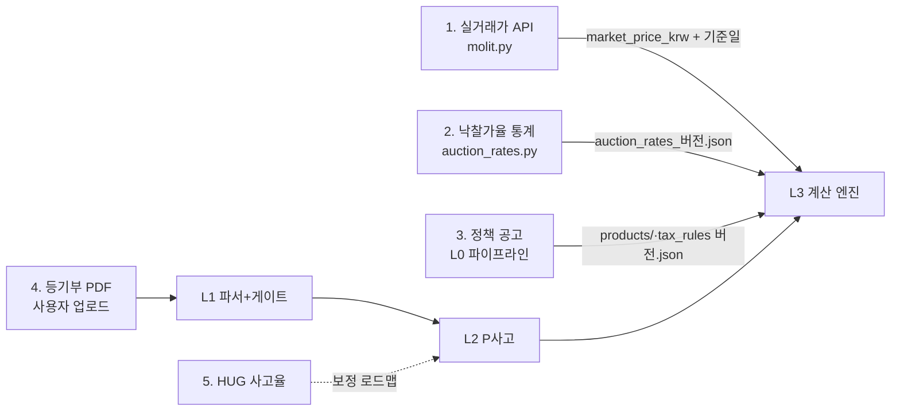

# 데이터 수집 파이프라인 — 방향과 절차

> 사분면: How-to + Reference. "각 데이터를 어디서, 어떻게, 얼마나 자주 가져와 룰 DB를 채우는가"에 답한다.
> 코드: [src/onjeon/data_pipeline/](../src/onjeon/data_pipeline/) · 키 설정: 루트 `.env` ([.env.example](../.env.example) 참조)

## 원칙 (CLAUDE.md 상속)

1. 모든 수집 결과에 **조회 기준일(queried_at)** 을 함께 저장한다.
2. 수집 결과는 **버전 태그 룰 JSON**(`rules/*_{YYYY-MM}.json`)으로 발행한다 — 로더(`rules_io.load_rules`)가 최신 버전을 집는다.
3. 금액은 수집 시점에 **원(₩) 정수**로 변환한다 (실거래가 API는 만원 단위 문자열).
4. 미검증 수치는 `[확인]` 마커를 유지하고, 원문 대조 후 마커를 제거하며 출처·기준일을 남긴다.

## 데이터 소스 5종 — 수집 방향

| # | 데이터 | 소스 | 수집 방법 | 주기 | 담당 코드 / 산출물 |
|---|---|---|---|---|---|
| 1 | 시세 (실거래가) | 국토부 실거래가 API (공공데이터포털, 무료) | REST API — `.env`의 `MOLIT_API_KEY` | 매물 분석 시 온디맨드 | `data_pipeline/molit.py` → `property.market_price_krw` + `price_source.queried_at` |
| 2 | 낙찰가율 | 법원경매정보 지역·유형별 통계 | 공개 API 없음 → 월 1회 통계표 수동 수집 → rows | 월 1회 | `data_pipeline/auction_rates.py` → `rules/auction_rates_{YYYY-MM}.json` |
| 3 | 세제·정책상품 요강 | 국가법령정보센터·기금e든든·주택도시기금 | L0 파이프라인 (공고 → 룰 JSON, 추출↔검증 LLM 분리 + 경계값 테스트) | 공고 변경 감지 시 | `l0/rule_pipeline.py` → `rules/products/*.json`, `rules/tax_rules_*.json` |
| 4 | 등기부등본 | 인터넷등기소 (열람 700원/건, 실시간 API 부재) | 사용자 업로드 (PDF→이미지) | 사용자 요청 시 | `l1/parser.py` — 아래 "L1 정확도 표 절차" 참조 |
| 5 | 보증사고율 (P(사고) 베이스) | HUG 국정감사 제출자료·공개 통계 `[확인]` | 수동 수집 → L2 베이스라인 보정 | 분기 1회 | `l2/synth.py` 계수 보정 (현재는 합성 — 구조 시연) |

## 레이어 연결



## 사용법

### 시세 조회 (실거래가)

```python
from onjeon.data_pipeline.molit import fetch_trades, median_price_krw

result = fetch_trades("11620", "202606")           # 관악구, 2026-06 (MOLIT_API_KEY 필요)
price = median_price_krw(result["trades"])          # 중위가 — 보수적 대표값
# property.market_price_krw = price, price_source = result["source"] (기준일 포함)
```

### 낙찰가율 룰 발행 (월 1회)

```python
from onjeon.data_pipeline.auction_rates import build_auction_rates, write_auction_rules

rows = [  # 법원경매정보 통계표에서 수집 — 'default' 지역 필수
    {"region": "관악구", "building_type": "빌라", "rate": 0.78},
    {"region": "default", "building_type": "빌라", "rate": 0.75},
]
rules = build_auction_rates(rows, version="2026-08", source="법원경매정보", queried_at="2026-08-01")
write_auction_rules(rules)   # rules/auction_rates_2026-08.json — 로더가 자동으로 최신본 사용
```

### 정책 룰 갱신 (L0)

공고 원문 텍스트를 `l0.rule_pipeline.pipeline()`에 넣는다 (Streamlit "룰 추출 라이브" 탭과 동일 경로). 승인(approved) 결과만 `rules/products/`에 저장한다. 스키마 위반·경계값 실패·저신뢰(needs_human)는 자동 반영 금지.

## L1 정확도 표 절차 (남은 1주차 목표)

1. 인터넷등기소에서 유형 다양하게(빌라 위주) 등기부 10건 열람·PDF 저장 — 개인정보는 마스킹.
2. 각 건을 `parse_register()`로 추출 → 사람이 원문 대조하며 필드별 정오표 기록 (채권최고액·설정일·말소여부·순위).
3. `docs/l1-accuracy.md`에 10×N 표로 정리 — 발표 자료의 "샘플 10건 정확도 표"가 된다.
4. 오추출 패턴은 `l1/parser.py`의 프롬프트에 few-shot 예시로 반영 후 재측정.

## `[확인]` 해제 체크리스트 (제출 전)

- [ ] 조특법 §95-2 2026년 세법 원문 대조 → `tax_rules` 버전 갱신
- [ ] 버팀목·중기청 대출 요강 최신본 대조 → `products/*` 갱신
- [ ] 관악구 빌라/오피스텔 낙찰가율 실통계 → `auction_rates` 재발행
- [ ] 실거래가 API 엔드포인트·응답 태그 실키로 검증 (`molit.py`)
- [ ] HUG 사고율 최신 통계 확보 → L2 베이스라인 문서화
