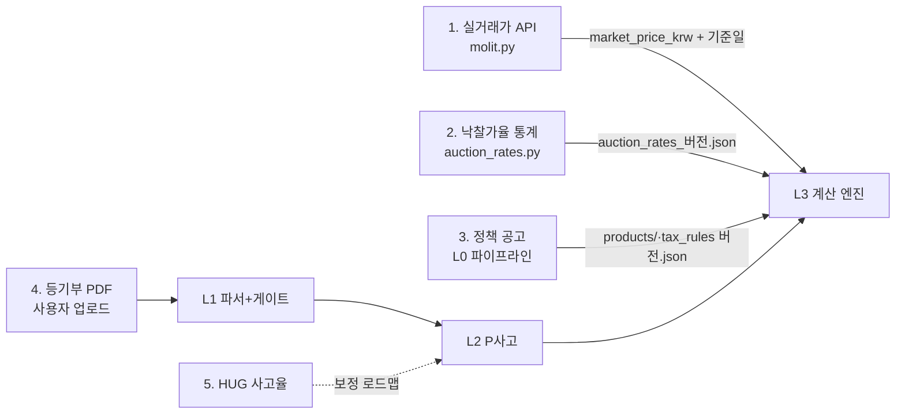

# 데이터 수집 파이프라인 — 방향과 절차

> 사분면: How-to + Reference. "각 데이터를 어디서, 어떻게, 얼마나 자주 가져와 룰 DB를 채우는가"에 답한다.
> 코드: [src/onjeon/data_pipeline/](../src/onjeon/data_pipeline/) · 키 설정: 루트 `.env` ([.env.example](../.env.example) 참조)

## 원칙 (CLAUDE.md 상속)

1. 모든 수집 결과에 **조회 기준일(queried_at)** 을 함께 저장한다.
2. 수집 결과는 **버전 태그 룰 JSON**(`rules/*_{YYYY-MM}.json`)으로 발행한다 — 로더(`rules_io.load_rules`)가 최신 버전을 집는다.
3. 금액은 수집 시점에 **원(₩) 정수**로 변환한다 (실거래가 API는 만원 단위 문자열).
4. **모든 수치는 근거 등급을 문장으로 달고 다닌다** — 원문 대조(날짜·출처), 2차 출처, 판단값,
   미확보 중 무엇인지 그 자리에 적는다. 마커 하나로 뭉뚱그리면 문서를 PDF·발표자료로 옮길 때
   맥락이 떨어져 나가 미검증 값이 확정값처럼 읽힌다.

## 데이터 소스 5종 — 수집 방향

| # | 데이터 | 소스 | 수집 방법 | 주기 | 담당 코드 / 산출물 |
|---|---|---|---|---|---|
| 1 | 시세 (실거래가) | 국토부 실거래가 API (공공데이터포털, 무료) | REST API — `.env`의 `MOLIT_API_KEY` | 매물 분석 시 온디맨드 | `data_pipeline/molit.py` → `property.market_price_krw` + `price_source.queried_at` |
| 2 | 낙찰가율 | 법원경매정보 지역·유형별 통계 | 공개 API 없음 → 월 1회 통계표 수동 수집 → rows | 월 1회 | `data_pipeline/auction_rates.py` → `rules/auction_rates_{YYYY-MM}.json` |
| 3 | 세제·정책상품 요강 | 국가법령정보센터·기금e든든·주택도시기금 | **지금은 반자동** — `fetch_law_clauses.py`로 조문·**별표** 원문을 받아 사람이 검수해 JSON에 넣는다. L0 자동 크롤링(추출↔검증 LLM 분리)은 코드만 있고 미가동 | 공고 변경을 사람이 확인할 때 | `scripts/fetch_law_clauses.py` → `rules/products/*.json`, `rules/tax_rules_*.json` (`l0/rule_pipeline.py`는 대기) |
| 4 | 등기부등본 | 인터넷등기소 (열람 700원/건, 실시간 API 부재) | 사용자 업로드 (PDF→이미지) | 사용자 요청 시 | `register/parse.py` — 아래 "L1 실물 검증 현황" 참조 |
| 5 | 사고확률 P(사고) 계수 | 한국부동산원 부동산테크 임대차 시장정보 (시군구×유형 920관측·4시점) | 시군구 집계표 → **집계 마진 보정**(학습 아님) | 통계 갱신 시 | `scripts/calibrate_risk_model.py` → `rules/risk_model_{YYYY-MM}.json`. `l2/synth.py`는 파이프라인 테스트용 픽스처이지 배포 계수를 만들지 않는다 |

## 레이어 연결


```mermaid
flowchart LR
    A[1. 실거래가 API<br/>molit.py] -->|market_price_krw + 기준일| L3[L3 계산 엔진]
    B[2. 낙찰가율 통계<br/>auction_rates.py] -->|auction_rates_버전.json| L3
    C[3. 정책 공고<br/>L0 파이프라인] -->|products/·tax_rules 버전.json| L3
    D[4. 등기부 PDF<br/>사용자 업로드] --> L1[L1 파서+게이트] --> L2[L2 P사고] --> L3
    E[5. HUG 사고율] -.보정 로드맵.-> L2
```

## 사용법

### 시세 조회 (실거래가)

```python
from onjeon.data_pipeline.molit import fetch_trades, median_price_krw

result = fetch_trades("11620", "202606")           # 관악구, 2026-06 (MOLIT_API_KEY 필요)
price = median_price_krw(result["trades"])          # 중위가 — 보수적 대표값
# property.market_price_krw = price, price_source = result["source"] (기준일 포함)
```

### 낙찰가율 룰 발행 (월 1회)

```python
from onjeon.data_pipeline.auction_rates import build_auction_rates, write_auction_rules

rows = [  # 법원경매정보 통계표에서 수집 — 'default' 지역 필수
    {"region": "관악구", "building_type": "빌라", "rate": 0.78},
    {"region": "default", "building_type": "빌라", "rate": 0.75},
]
rules = build_auction_rates(rows, version="2026-08", source="법원경매정보", queried_at="2026-08-01")
write_auction_rules(rules)   # rules/auction_rates_2026-08.json — 로더가 자동으로 최신본 사용
```

### 정책 룰 갱신 (L0)

공고 원문 텍스트를 `l0.rule_pipeline.pipeline()`에 넣는다 (Streamlit "룰 추출 라이브" 탭과 동일 경로). 승인(approved) 결과만 `rules/products/`에 저장한다. 스키마 위반·경계값 실패·저신뢰(needs_human)는 자동 반영 금지.

## RAG 인입 파이프라인 (Vector DB — Qdrant)

**역할 구분(절대 원칙)**: 자격 판정·비용 계산은 결정론 룰엔진(L3)이 한다. Vector DB는 **인용·검색 전용** — "왜 미자격인가", "조항 원문이 뭔가"에 근거를 찾아준다.

```
룰 DB(products/tax) + 공고 원문 → 조항 단위 문서(payload에 rule_id·clause·version·url)
  → 임베딩(FastEmbed ONNX, CPU, 비용 0) → Qdrant(임베디드 로컬, 서버 비용 0)
  → 검색 결과 = 곧 인용 (L4·UI '조항 검색' 탭)
```

| 결정 | 선택 | 비용·성능 근거 |
|---|---|---|
| Vector DB | Qdrant 임베디드(`:memory:`/`path=`) | 서버·Docker·클라우드 0원. 동일 코드로 Qdrant Cloud 승격 가능 |
| 검색 | **하이브리드**: dense + sparse(crc32 토큰, 서버측 IDF) → Query API RRF 융합 | 조문번호 등 리터럴 매칭 보강. MiniLM 기준 R@5 0.667→**0.900** (2026-07-19 골든셋 실측) |
| 임베딩 | 기본 MiniLM(384d, 클라우드 메모리 제약) / 로컬 `ONJEON_EMBED_MODEL=intfloat/multilingual-e5-large`(1024d) | e5-large 실측 R@5 **0.97**·MRR **0.911** (2026-07-26, fastembed 0.8.0). ⚠️ 2026-07-19 fastembed 구버전 측정치는 R@5 1.000·MRR 0.961이었으나 재현 불가 — fastembed가 e5-large 풀링을 CLS→mean으로 변경(0.5.1 핀 고정 시 구동작). 모델 2.24GB 최초 다운로드 필요. bge-m3는 설치 fastembed 미지원(확인됨). 미설치 환경은 해시 임베더 폴백 |
| 리랭커 | 구현·주입 가능(`rag/reranker.py`, bge-reranker-base), **기본 OFF** | 미스 1건 잔존(`서른다섯 살…` — 숫자 표기 대 한글 수사). 리랭커로 개선되는지는 미측정 — 켜기 전에 골든셋으로 실측할 것 |
| 평가 | 골든셋 30문항 `rag/eval.py` (Recall@5·MRR) | 모든 검색 변경은 이 하네스 수치로만 채택 |
| 청크 | 조항 단위 (룰 DB 구조 그대로) | 청크 전략 비용 0, 인용 정밀도 최대 |
| ID | 콘텐츠 해시(uuid5) | 재실행 멱등 — 중복 적재 없음. 임베딩 차원 변경 시 컬렉션 자동 재생성 |
| 튜닝 | HNSW·양자화 안 함 | 수백 벡터 규모 — 측정 없는 최적화 금지 |

- **적재(CLI)**: `.venv/bin/python -m onjeon.rag.ingest data/qdrant` (경로 생략 시 `ONJEON_QDRANT_PATH` → 기본 `data/qdrant`, gitignore)
- **자동 색인**: L0 파이프라인이 룰을 승인하면 UI가 `index_rule()`로 즉시 색인 — "정책이 바뀌면 검색도 바뀐다"
- **신규 소스 추가**: `rag/documents.py`의 collect_documents에 소스 함수를 추가하면 파이프라인 전체에 반영

## L1 실물 검증 현황 (2026-08-02)

실물 발급본 **3건**으로 검증했다 — 노원구 공릉동 412-13·559-22(건물, 다중주택)와
559-27 제101호(**집합건물**). 사람이 원문과 대조한 정답을 `tests/test_register_real.py`의
31개 테스트가 고정한다: 주소·도로명주소·전용면적·채권최고액·용도·층·호수·말소 처리.
파일은 소유자 실명이 담긴 발급본이라 저장소에 없다(`.gitignore`가 디렉터리째 차단) — 없으면 skip.

실물이 잡아낸 결함(합성 픽스처는 전부 통과시켰다): 요약절 근저당 2배(함정 4), 집합건물
전유부분(함정 10), 말소 취소선(함정 11), OCR 소수 1자리(함정 12), 도로명주소에 옆 칸 글자
혼입(함정 13 — 3건 중 **3건** 틀렸다).

**남은 것**(유형이 모여야 정확도 표가 의미를 갖는다. 3건은 표가 아니라 회귀 테스트다):

1. 스캔·촬영본 실물 0건 — OCR 경로는 합성 촬영본으로만 검증됐다.
2. 아파트·오피스텔 실물 0건 — 집합건물 실물은 도시형생활주택 1건뿐이다.
3. 확보하면 필드별 정오표를 `docs/l1-accuracy.md`에 유형×필드 표로 정리한다.

## 원문 대조 현황 (제출 전 체크리스트)

체크된 줄은 원문을 직접 확인한 것이고, 빈 줄은 아직 2차 출처나 판단값에 기대고 있다는 뜻이다.

- [x] 조특법 §95-2 세액공제 (2026-07-18 웹 검증: 5,500만 이하 17% / 8,000만 이하 15% / 한도 1,000만원 — 국세청 안내 일치. ⚠️ 17%→30% 상향 개정안 국회 발의 중, 통과 시 재발행)
- [x] 버팀목 요강 (2026-07-18: 만19~34·부부합산 5천만·순자산 3.37억·보증금 3억·한도 2억 확인)
- [x] 중기청 대출 요강 (2026-07-18: 외벌이 3,500만·보증금 2억·한도 1억·금리 1.2% 확인. ⚠️ 일부 은행 판매중지 표기 — 지속 여부 재확인)
- [x] 서울 빌라 낙찰가율 (2026-07-18: 2026 상반기 일반 응찰 73~75% → 관악 0.74/기본 0.71 반영)
- [x] HUG 사고 통계 (2026-07-18: 2025년 사고 6,677건·1.24조원, 사고율 2.2%(2025-08) — 피크 2023-05 8.1%. **L2 합성 모델의 기저율 앵커로 실제 반영** — 절편 -7.5로 모집단 평균 사고율 2.1% 정렬(기존 임의값 10.9% → 실통계 정렬). 연령대 비중은 미확보)
  <br/>↳ **2026-08 이후 이 앵커는 쓰지 않는다.** 계수 출처가 부동산테크 시군구 공개통계
  집계 마진 보정(`risk_model_2026-08`)으로 바뀌었다. 위 줄은 그때의 기록으로 남긴다.
- [ ] 오피스텔·아파트 낙찰가율 — 법원경매정보 통계 원본 대조
- [ ] 취득세·보유세·중개보수 요율 — 지방세법·시행규칙 원문 대조
- [x] 실거래가 API 실키 검증 (2026-07-19: 관악구 2026-06 매매 154건 수신, 영문 태그 파싱 확인. 향후 개선: 면적·법정동 필터로 매물 단위 시세 정밀화)
- [ ] 버팀목 소득구간별 실금리(2.0~3.3%)로 loan_rate_jeonse 대체 검토
