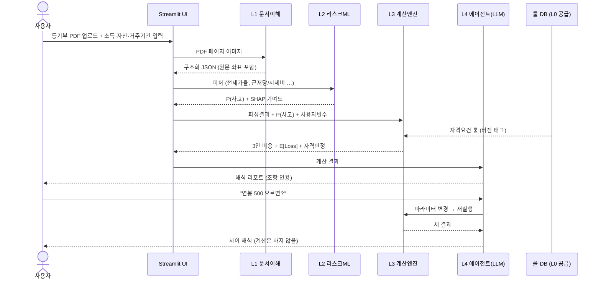

# 상세 설계도 — 모듈 스펙 · 수식 · 데이터 스키마 · 화면

> 사분면: Reference. "정확히 무엇을 어떻게 만드는가"에 답한다.
> 계층 구조의 '왜'는 [architecture.md](architecture.md), 일정·역할은 [workflow.md](workflow.md) 참조.
> ⚠️ `[확인]` 마커: 최신 수치·요강 기준 검증 후 확정할 항목.

## 1. 사용자·페르소나

**김서연(26), 사회초년생 2년차, 연소득 3,600만원, 가용자산 3,000만원.**
서울 관악구 보증금 1.2억 빌라 전세 vs 보증금 1,000/월세 65 오피스텔 사이에서 고민 중.

### 사용자 여정 (현재 → 온전)

| 단계 | 현재의 여정 (분절) | 온전에서의 여정 (통합) |
|------|------|------|
| 매물 검토 | 부동산 앱에서 시세만 확인 | 등기부 PDF 업로드 → AI 파싱 |
| 위험 확인 | 안심전세앱 별도 조회 → "주의" 등급만 확인 | 채권최고액·선순위 자동 추출 + 기대손실 ₩ 환산 |
| 비용 비교 | 계산기 사이트에서 이자만 단순 계산 | 세후·기회비용·기대손실 포함 3안 비교 |
| 대출 자격 | 상품 100개 각각 공고문 검색 | 소득·자산 입력 → 자격 자동판정 + 미자격 사유·원문 인용 |
| 결정 | 감(感) | "이 매물은 월세가 유리 + ○○대출 자격 있음" 리포트 |

### 사용 흐름 시퀀스



## 2. 모듈 C — 계약 리스크 스캐너 (문서 AI)

1. 등기부등본 PDF 업로드 → 문서 AI가 표제부/갑구/을구 파싱
2. 추출 항목: 채권최고액, 근저당 설정일, 선순위 임차권, 압류·가압류, 소유권 변동 이력
3. 시세(국토부 실거래가 API `[확인]`) + 지역별 경매 낙찰가율 대입
4. **출력: "경매 시 회수 예상액 ○○원 / 미회수 위험액 ○○원"** + 모든 수치에 등기부 원문 위치 인용

### L1 추출 결과 JSON 스키마 (초안)

```json
{
  "property": {
    "address": "string",
    "building_type": "빌라 | 오피스텔 | 아파트 | 기타",
    "market_price_krw": "integer — 시세 (조회 기준일 필수)",
    "price_source": { "api": "국토부 실거래가", "queried_at": "YYYY-MM-DD" }
  },
  "register": {
    "title_section": { "owner": "string", "ownership_changes": [] },
    "gap_section": [
      { "rank": 1, "type": "압류 | 가압류 | 소유권이전", "date": "YYYY-MM-DD",
        "cancelled": false, "source_loc": { "page": 1, "section": "갑구", "entry_no": 3 } }
    ],
    "eul_section": [
      { "rank": 1, "type": "근저당권설정", "max_claim_krw": 240000000,
        "set_date": "YYYY-MM-DD", "cancelled": false,
        "source_loc": { "page": 2, "section": "을구", "entry_no": 3 } }
    ],
    "senior_lease_deposits_krw": "integer — 선순위 임차 보증금 합계"
  }
}
```

**검증 규칙**: 필수 필드 누락 시 하위 레이어로 전달 금지. 모든 항목에 `source_loc`(원문 좌표) 필수 — 인용·하이라이트의 근거.

## 3. 모듈 A — 주거 의사결정 엔진 (결정론적 계산 + LLM 해석)

1. 입력: 모듈 C 파싱 결과(자동) + 사용자 변수(소득·자산·거주 예정 기간)
2. 전세/월세/매수 3안의 **세후 총비용** 산출
   - 공통: 대출이자(실금리), 기회비용(청년도약계좌 등 대안수익률 `[확인: 현재 금리]`)
   - 월세: 세액공제 (조특법 §95-2, 총급여 구간별 15~17% `[확인: 2026년 세법]`)
   - 매수: 취득세·중개보수·보유세
   - **전세: 명목비용 + λ·기대손실** ← 핵심 차별점
3. 정책상품 자격 룰엔진: 자격 판정 + **미자격 반증**(어느 조항·얼마 초과·차선 상품)
4. LLM은 계산하지 않는다 — 결과 해석, 근거 인용, 후속 질의응답만 담당

## 4. 기대손실 수식 (방법론의 급소 — 정면 돌파) {#기대손실-수식}

```
전세 실질비용 = 명목비용(이자 + 기회비용) + E[Loss]

E[Loss] = P(사고) × LGD × 보증금

P(사고): 매물 특성 기반 사고확률
  - 베이스: HUG 유형별 보증사고율 [확인: 최신 통계]
  - 조정 피처: 전세가율, 근저당/시세 비율, 건물유형(빌라 가중),
    임대인 다주택·체납 신호(확인 가능 범위 내)

LGD(손실률): 1 − (예상낙찰가 − 선순위채권) / 보증금
  - 예상낙찰가 = 시세 × 지역·유형별 낙찰가율 (법원경매 공개 데이터)
  - 보증보험 가입 가능 매물이면 LGD를 보험 반영 후 값으로 대체
```

**한계 명시(제안서에 그대로 씀)**: 임대인 국세 체납 등 등기부 외 리스크는 커버 불가 → 보증보험 가입 유도 로직으로 보완. 정밀 계수는 KB 내부 전세대출·보증사고 데이터 결합 시 고도화 가능 — 이것이 곧 **KB 도입 논거**(B2B: 심사 참고지표 → 사고율·회수율 개선 = 은행 손실 절감).

### 계산 엔진 함수 설계 (L3, 순수 함수)

```
annual_cost_jeonse(deposit, loan_rate, opportunity_rate, e_loss) -> int
annual_cost_wolse(deposit, monthly_rent, income, tax_rules) -> int   # 세액공제 반영
annual_cost_buy(price, acquisition_tax_rules, holding_tax_rules, brokerage) -> int
expected_loss(p_accident, lgd, deposit) -> int
lgd(market_price, auction_rate, senior_claims, deposit, insured) -> float
eligibility(user, rule_json) -> {eligible: bool, failed_clauses: [...], alternatives: [...]}
```

모든 함수는 단위 테스트 필수. 금액은 원(₩) 정수. 세제·상품 규칙은 인자로 주입(룰 DB) — 함수 내 하드코딩 금지.

## 5. 룰 DB 스키마 (L0 산출물, 초안)

```json
{
  "rule_id": "youth-jeonse-loan-2026-07",
  "product_name": "string — 정책상품명",
  "version": "2026-07 기준",
  "source": { "url": "공고 원문 URL", "clause_refs": ["제3조 1항"] },
  "criteria": [
    { "field": "age", "op": "<=", "value": 34, "clause": "제3조 1항",
      "boundary_tests": [{ "input": 34, "expect": true }, { "input": 35, "expect": false }] },
    { "field": "annual_income_krw", "op": "<=", "value": 50000000, "clause": "제3조 2항" }
  ],
  "confidence": "high | low — low는 사람 승인 큐로",
  "approved_by_human": false
}
```

**미자격 반증 출력 형식**: 어느 조항(clause) 위반 + 얼마 초과 + 차선 상품 목록.

## 6. 핵심 출력 화면 (데모의 결정적 한 장)

```
연간 실질 주거비용 비교 (리스크 조정 후)

전세   ████████████ 420만  ▓▓▓▓▓ +180만(기대손실)  = 620만
월세   ██████████████ 540만                        = 540만  ★ 최적
매수   █████████████████ 710만                     = 710만

근거: 채권최고액 2.4억(등기부 을구 3번) / 예상 낙찰가 2.1억(관악구
최근 1년 낙찰가율 78%) / 선순위 공제 후 회수 예상 0.9억
```

구성 요소:
1. **3안 막대 차트** — 전세 막대 위에 기대손실이 별도 색으로 얹힘 (₩ 정량화의 시각화)
2. **SHAP 워터폴** — "이 매물의 위험이 높은 이유"가 피처별로 분해
3. **근거 패널** — 모든 수치에 등기부 원문 위치·데이터 출처 인용
4. **자격 판정 카드** — 자격 상품 / 미자격 사유(조항 인용) / 차선 상품

## 7. 데이터 소스 · 실현가능성

| 데이터 | 소스 | 확보 방법 | 비고 |
|---|---|---|---|
| 등기부등본 | 인터넷등기소 | 사용자 업로드 (열람 700원/건) | 실시간 API 부재 — 한계 선명시 |
| 시세 | 국토부 실거래가 API | 공공데이터포털 (무료) | KB시세 대체 시 정밀도↑ (도입 논거) |
| 낙찰가율 | 법원경매정보 | 공개 통계 | 지역·유형별 |
| 세제·상품 요강 | 국가법령정보·기금e든든 등 | 크롤링 + 수동 검수 | **기준일 버전 관리 필수** |
| 소득·자산 | 사용자 입력(MVP) → 마이데이터(확장) | — | KB 연계성 핵심 |

## 8. 경쟁 비교 (경쟁자 후하게, 빈 칸으로 승부)

| 기능 | 안심전세앱 | 세이프홈즈류 | 계산기 사이트 | 토스 알림 | **온전** |
|---|:-:|:-:|:-:|:-:|:-:|
| 시세·위험 정보 조회 | ✅ | ✅ | — | — | ✅ |
| 등기부 자동 분석 | 부분 | ✅ | — | — | ✅ |
| 리스크 **₩ 정량화**(기대손실) | — | — | — | — | ✅ |
| 전세/월세/매수 세후 비교 | — | — | 항목별만 | — | ✅ |
| 개인 자격 반영(소득·자산) | — | — | — | — | ✅ |
| 미자격 반증 + 원문 인용 | — | — | — | — | ✅ |
| 계약 후 등기 변동 모니터링 | — | 부분 | — | ✅ | ✅(확장) |
| 대출 실행 연계 | — | — | — | — | ✅(KB) |

`[확인: 각 서비스 최신 기능 — 제출 전 재검색 필수]`

**방어 논리**:
- *"안심전세앱이 무료인데?"* — 규제기관은 '판단'을 제공할 수 없다(특정 선택 권유 시 책임 문제). 은행은 자문·실행이 본업 — "월세가 유리하고, 자격 되는 대출은 이것"까지 가는 것은 주체 성격상 은행만 가능.
- *"세이프홈즈와 뭐가 다른가?"* — 위험 등급(정성)에서 멈추지 않고 기대손실(₩)로 환산해 재무 비교에 통합 — 출력의 차원이 다름.

## 9. 리스크 & 정직한 한계

1. 법률 자문 아님 — 정보 제공 고지 + 판정 결정론화 + 원문 인용 원칙
2. 등기부 외 리스크(체납 등) 미커버 — 보증보험 유도로 보완, 한계 명시
3. 세법·상품 변경 — 룰을 데이터로 분리, "2026년 ○월 기준" 명기
4. 사고확률 계수의 불확실성 — 공개 통계 기반 보수적 추정 + KB 데이터 결합 고도화 로드맵 제시

## 10. 기대효과 · 확장

- **정성**: 정보 비대칭 해소, 사기 예방 — 사회적 가치 축
- **정량(제시 논리)**: 위험 매물 사전 회피율 × 평균 보증금 = 예방 가능 피해액; KB 측은 심사 참고지표 활용 시 보증사고율·회수손실 절감
- **확장**: 신혼부부·외국인·고령 임차인 / 만기 3개월 전 자동 재점검 → 사고 대응(모듈 D)

## 관련 문서

- 계층 구조의 근거 → [architecture.md](architecture.md)
- 구현 일정·데모 시나리오 → [workflow.md](workflow.md)
- 코드 컨벤션 → [CLAUDE.md](../CLAUDE.md)
