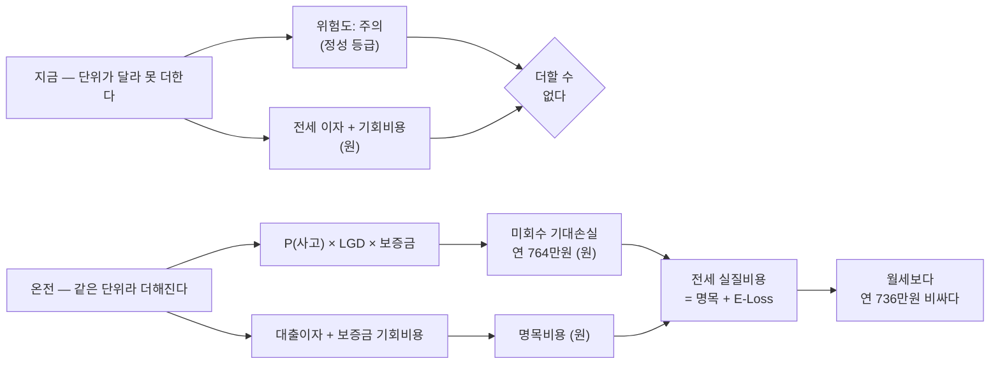
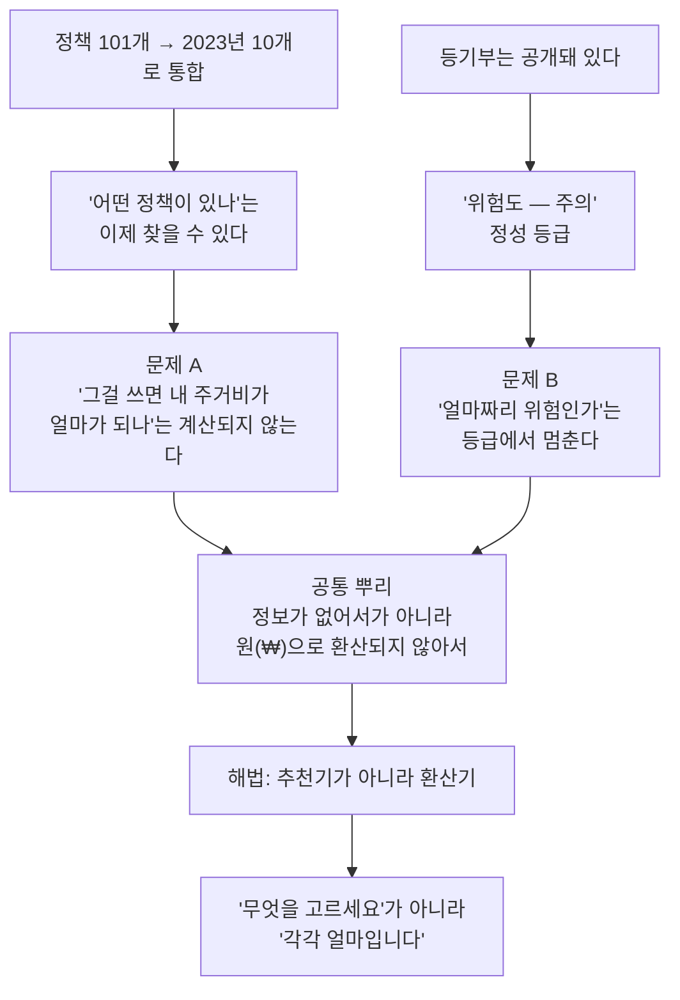
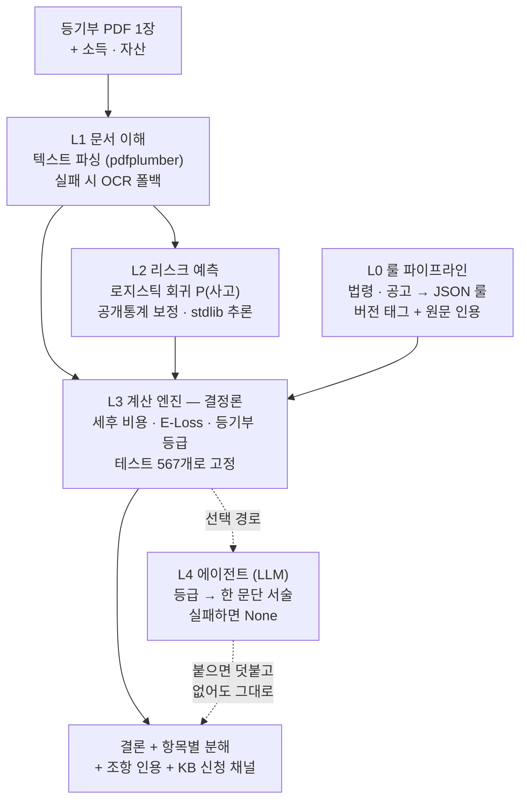

# 과제 요약 — 온전(穩全)

**리스크 조정 주거비용 기반 청년 주거 의사결정 AI**

> 제출·발표용 요약입니다. 폼의 글자수 제한에 맞춰 150자 / 400자 / 전문 세 단으로 나눠 뒀습니다.
> 근거의 상세는 [problem.md](problem.md), 구현은 [architecture.md](architecture.md)를 보시면 됩니다.
> 인용한 수치에는 출처와 조사연도를 붙였고, 원문을 대조하지 못한 것은 본문에서 주장으로 쓰지 않았습니다.

---

## 한 줄 정의

등기부등본 한 장으로 "이 집, 위험을 감안하면 전세가 월세보다 정말 싼가"에 원(₩)으로 답합니다.
추천하지 않고 계산합니다.

---

## 150자 요약

> 청년 주거의 병목은 자본이 아니라, 흩어진 정보가 원으로 환산되지 않는다는 데 있습니다.
> 온전은 등기부 한 장에서 위험을 기대손실로 바꾸고, 개인 조건에 맞는 정책·금융상품을 자동
> 판정해, 전세와 월세의 실질 연비용 차이를 계산합니다. 매물을 추천하지 않고 연산만 합니다.

## 400자 요약

> 정책은 이미 많습니다. 정부는 2023년에 청년 주거정책 193개를 10개로 통합했습니다. 그런데
> "어떤 정책이 있는가"는 이제 찾을 수 있어도, 그걸 써서 내 주거비가 얼마가 되는지는 여전히
> 아무도 계산해주지 않습니다. 위험도 사정이 같습니다. 등기부는 공개돼 있지만 "위험도 주의"라는
> 등급은 비용에 더할 수가 없습니다.
>
> 온전은 환산기입니다. 등기부 PDF 한 장에서 주소·전용면적·채권최고액·권리제한을 뽑아내고,
> 보증금을 못 돌려받을 위험을 기대손실 `E[Loss] = P(사고) × LGD × 보증금`으로 바꿔서, 정책
> 혜택을 반영한 전세·월세 연비용에 더합니다. 판정과 계산은 전부 결정론 코드가 하고 LLM은
> 숫자를 만지지 않습니다.
>
> 실측해보니 혜택만 따졌을 때는 전세가 연 28만원 쌌는데, 기대손실을 반영하자 연 736만원
> 비싼 것으로 결론이 뒤집혔습니다. 자격이 되는 상품은 KB 신청 채널로, 자격이 안 되는 경우는
> 사유와 함께 KB 자체 상품으로 연결합니다.

---

# 전문

## 배경

### 정책이 없어서 생긴 문제가 아닙니다

2023년 3월 기준으로 정부와 수도권 3개 지자체가 운영하던 청년 주거정책은 101개였습니다.
나이 기준이 다르고, 소득 기준이 다르고, 부모 소득을 보는 곳과 안 보는 곳이 갈렸습니다.
자기가 대상인지 확인하는 것부터가 일이었죠. 언론은 이걸 "몰라서 못 쓴다"로 요약했습니다.

수요 자체는 대출에 몰려 있습니다. 2022년 청년 삶 실태조사에서 가장 필요한 주거정책 1순위는
주택구입자금 대출(31.3%)과 전세자금 대출(25.0%)이었고, 월세 등 주거비 지원이 20.7%,
공공임대 공급이 14.9%로 뒤를 이었습니다. 절반 이상이 대출입니다. 즉 "얼마를 빌려 얼마를
갚는가"라는 계산이 필요한 항목이죠.

### 정부는 이미 손을 댔습니다. 그래서 우리 문제는 그 다음입니다

2023년 8월, 전국 청년 주거정책 193개가 4유형 10개로 정리됐고 마이홈 앱에 청년전용 페이지가
생겼습니다. 목록을 모으는 일은 이렇게 끝났습니다.

남은 건 환산입니다. 정책 이름과 금리표를 봐도, 자기 보증금·자산·소득을 넣어서 연비용으로
바꾸는 일은 여전히 사용자 몫입니다. 자격이 되는지는 조회할 수 있지만 "그래서 얼마"는 나오지
않습니다.

| | 마이홈 등 통합 포털 | 온전 |
|---|---|---|
| 정책을 한곳에 모은다 | 한다 | 한다 |
| 자격 여부를 알려준다 | 자가진단 | 자가진단 + 미자격 시 어느 조항에서 얼마 초과인지 |
| 이 집에 이 상품을 쓰면 연 얼마인가 | | 조달 분해(자기자본/정책대출/시장금리) |
| 이 매물의 위험이 얼마인가 | | 기대손실 원(₩) |
| 그래서 전세와 월세 중 뭐가 싼가 | | 계산해서 답한다 |

### 청년은 지금 정확히 갈림길에 서 있습니다

| 점유형태 | 2022년 | 2024년 |
|---|---:|---:|
| 자가(부모소유 포함) | 55.8% | 49.6% |
| 전세 | 21.5% | 23.8% |
| 월세 | 19.0% | 23.8% |

전세와 월세가 동률이 됐습니다. 2022년에는 전세가 앞섰는데 2년 만에 월세가 따라잡았죠.

이 동률이 이 프로젝트의 시장입니다. 한쪽이 압도적이면 고민할 일도 없습니다. 둘이 같다는 건
지금 이 순간 가장 많은 청년이 실제로 저울질하고 있다는 뜻입니다.

### 그런데 저울의 한쪽에 눈금이 없습니다

전세를 고를 때 사람들이 세는 건 이자와 기회비용입니다. 세지 않는 게 하나 있습니다.
보증금을 못 돌려받을 위험이죠. 이건 등급으로만 존재합니다.

"주의"라는 말은 결정을 도와주지 않습니다. 주의하니까 하지 말라는 건지, 주의하면서 하라는
건지 알 수가 없으니까요. "연 736만원 비싸다"는 그 자체로 판단 재료가 됩니다.



## 두 문제의 뿌리는 하나입니다

정보가 없어서 생긴 문제가 아닙니다. 정보가 가계부에 못 들어가서 생긴 문제입니다.



---

## 해결 방안

### 연산은 하지만 추천은 하지 않습니다

이 구분이 제품의 정체성이라 먼저 정의를 못박아 둡니다.

**하지 않는 것.** 매물을 고르지 않습니다. 주관적 선호를 넣지 않습니다. "이 집을 계약하세요"라고
말하지 않습니다.

**하는 것.** 자격을 판정하고, 자격이 되는 상품을 금리 오름차순·한도 내림차순으로 정렬하고,
자격이 안 되면 어느 조항에서 얼마가 초과됐는지와 차선책을 제시합니다.

정렬 기준이 공개돼 있으니 재현이 됩니다. 같은 입력에 같은 출력이 나오고, 왜 그 순서인지
사용자가 직접 검산할 수 있습니다. 이게 추천과 연산의 차이입니다.

### 입력은 하나, 출력은 셋

등기부등본 한 장과 소득·자산 몇 줄이 입력입니다. 등기부 하나에서 주소, 전용면적, 용도,
채권최고액, 권리 제한이 함께 나오는데 이 다섯 개가 시세 추정과 위험 계산 양쪽의 입력이 됩니다.

| 출력 | 답하는 질문 |
|---|---|
| 혜택 매칭 + 미자격 반증 | 나에게 적용되는 상품은? 안 되면 어느 조항에서 얼마 초과? 차선은? |
| 위험 측정 | 이 매물에 적힌 권리 제한은? 보증금 미회수 기대손실은 얼마? |
| 비용 간격 | 정책을 적용한 뒤, 전세와 월세의 실질 연비용 차이는 얼마? |

핵심 수식은 이렇습니다.

```
전세 실질비용 = 명목비용(이자 + 기회비용) + E[Loss]

E[Loss] = P(사고) × LGD × 보증금
  P(사고)  전세가율·근저당비율·건물유형·낙찰가율로 추정한 연간 사고확률
  LGD      1 − (예상낙찰가 − 선순위채권 + 최우선변제) / 보증금
```

---

## 차별점은 실측으로 증명합니다

### 계산하면 결론이 뒤집힙니다

관악구 봉천동 빌라, 전용 40㎡, 전세 2억, 선순위 채권최고액 1.2억, 4년 거주를 가정한
2026년 7월 27일 실측값입니다.

| 어디까지 계산했나 | 전세 − 월세 | 결론 |
|---|---:|---|
| 정책 혜택까지 반영 (이자 + 기회비용 포함) | −28만원 | 전세 유리 |
| 여기에 미회수 기대손실을 더함 | +736만원 | 전세 불리 |

이자와 기회비용만으로는 뒤집히지 않았습니다. 기대손실을 얹은 뒤에야 부호가 바뀌었죠.
이게 온전이 한 발 더 나간 지점입니다. 기존의 "전세대출 이자 대 월세" 프레임으로는 잡히지
않는 역전이니까요.

### 43배 범위인데 결론을 말할 수 있나

사고확률이 공개 통계 4개 시점에서 1.35%에서 14.51%까지 움직였습니다. 그래서 점추정 하나가
아니라 범위를 냅니다. 그러면 곧바로 반문이 옵니다. 범위가 43배인데 결론도 범위 아니냐는 거죠.

이 매물에서는 아닙니다. 밴드 전체를 대입해도 부호가 바뀌지 않습니다.

| 시나리오 | E[Loss] | 전세 − 월세 |
|---|---:|---:|
| 혜택만 | 0 | −28만원 |
| 밴드 하한 (P=1.35%) | 93만 | +65만원 |
| 점추정 | 764만 | +736만원 |
| 밴드 상한 (P=14.51%) | 4,019만 | +3,991만원 |

가장 낙관적인 사고확률을 써도 전세가 비쌉니다. 범위는 정직성 장치이면서 동시에 결론의
강건성 검사이기도 합니다. 다른 매물에서 밴드가 부호를 가로지른다면 정직한 답은 "모른다"이고,
화면도 그렇게 말합니다.

### 경쟁 대비 빈 칸

경쟁자를 후하게 적었습니다. 그래야 빈 칸이 의미가 있으니까요.

| 기능 | 공공포털 | 안심전세앱 | 프롭테크 | 핀테크 | 온전 |
|---|:-:|:-:|:-:|:-:|:-:|
| 정책 목록·자격 진단 | 있음 | | | 부분 | 있음 |
| 등기부 분석·위험 정보 | | 있음 | 있음 | | 있음 |
| 대출 비교·실행 | | | | 있음 | 있음 |
| 미자격 반증 + 조항 인용 | | | | | 있음 |
| 리스크 ₩ 정량화 | | | | | 있음 |
| 전세 대 월세 세후 비교 | | | | | 있음 |

마이홈은 "어떤 정책이 있고 자격이 되는가"에 답합니다. 프롭테크는 "이 집이 위험한가"에,
핀테크는 "받을 수 있는 대출이 무엇인가"에 답하고요. 그런데 "그래서 이 집을 이 조건으로
계약하면 연 얼마인가"에는 아무도 답하지 않습니다.

---

## 구현

### 숫자는 AI가 만들지 않습니다



금융에서 숫자가 틀리면 안 되니까 판정과 계산은 전부 결정론 코드가 맡습니다. LLM은 등급을
한 문단으로 풀어 쓰는 곁가지에만 쓰이고, 그마저 꺼도 제품은 그대로 돌아갑니다. L2 계수는
한국부동산원 부동산테크 공개통계를 집계 마진 보정해서 얻었습니다. 시군구와 주택유형을 교차한
920개 관측치, 4개 시점입니다. 학습이 아니고 추론은 stdlib 한 줄입니다.

### 모르면 계산하지 않습니다

시세나 선순위를 못 읽으면 기대손실을 0으로 두지 않고 사유를 남깁니다. 0은 화면에서
"위험 없음"으로 읽히니까요. 전용면적을 특정하지 못하면 자동으로 채우지 않습니다. 서울 밖은
계산 자체를 막습니다. 근거가 반쪽인 결론을 내느니 입구에서 거절하는 쪽을 택했습니다.

### 검증 현황

테스트 567개가 통과합니다. 구간표 세율, 단위 경계(만원과 원), 컨테이너 의존성, 등기부 파싱
네 경로(집합건물·건물·말소·OCR)를 고정하고 있습니다. 배포 경로는 셋(로컬 터널, Hugging Face
Spaces, Render)이고 전부 동작을 확인했습니다.

실물 등기부 발급본으로 파이프라인 전체를 고정하는 테스트를 따로 둡니다. 합성 픽스처가 실제
형식과 다르면 테스트가 아무것도 보증하지 못한다는 걸 이미 세 번 겪었기 때문입니다.
현재 발급본 3건(건물 2·집합건물 1)에 31개 테스트가 걸려 있고, 주소·전용면적·채권최고액·
용도·말소 처리를 사람이 원문과 대조한 정답으로 고정합니다.

---

## KB 연계

측정만 하고 끝내면 다시 사용자 몫으로 돌려주는 셈입니다. 결과에 따라 갈래를 둘로 나눴습니다.

혜택 대상자에게는 어느 상품을 어디서 신청하는지까지 알려줍니다. 정책 기금상품의 수탁은행이
KB국민은행이라 영업점이나 KB스타뱅킹으로 자연스럽게 이어집니다.

혜택 비대상자에게는 미자격 반증(어느 조항에서 얼마 초과인지)과 함께 KB 청년 맞춤형
전세자금대출로 연계합니다.

그리고 모든 사용자에게, 계산에 쓴 시중금리가 익명의 '시장금리'가 아니라 KB의 실측 실행금리라는
사실을 밝히고 신청 경로를 엽니다.

---

## 기대효과

**B2C.** 인생에서 가장 큰 금융 결정 앞에서 청년이 놓치던 혜택을 온전히 받고, 정성 등급으로는
보이지 않던 위험을 금액으로 확인한 뒤 결정합니다. 생애주기 금융의 진입점이자 청년 접점입니다.

**B2B(KB 내부).** 같은 엔진이 전세대출 심사의 참고지표가 됩니다. 지금 계수는 공개 통계 보정이라
거칠지만, KB 내부 전세대출·보증사고 데이터와 결합하면 정밀도가 바로 올라갑니다. 은행이 이 구조를
보유할 때만 생기는 이득이고, 사고율과 회수손실 절감으로 이어집니다.

**확장.** 청년에서 집을 구하는 사람 전반으로 넓힙니다. 지역을 전국으로 확대하려면 실거래 시세
캐시와 주택임대차보호법 시행령의 4개 지역구간을 함께 채워야 합니다. 둘 중 하나만으로는 위험이
왜곡되니까요. "온전한 나의 집"은 청년만의 목표가 아닙니다.

---

## 한계

숨기면 신뢰를 잃습니다. 화면과 문서 양쪽에 적습니다.

1. 법률 자문이 아니라 정보 제공입니다. 그래서 판정을 결정론화하고 모든 출력에 원문을 인용합니다.
2. 등기부 밖의 위험은 못 봅니다. 임대인의 국세 체납이나 미신고 선순위 임차인 같은 것들이죠.
   구조적으로 불가능해서 보증보험 가입 유도로 보완합니다.
3. 사고확률 계수가 거칩니다. 시군구 집계로 개별 매물을 추정하니 생태학적 오류의 위험이 있습니다.
   그래서 점추정 대신 밴드를 냅니다.
4. 시세는 지역 평균 추정치입니다. 특정 호실의 시세가 아니고, 집계 단위에 따라 불확실성 폭도
   달라집니다.
5. 현재 범위는 서울 25개 구이고, 상품 룰은 7종입니다. 청년 전세·월세지원·청약, 중기청, 신혼,
   디딤돌, KB 자체 상품.
6. 파싱은 실물 발급본 3건(건물 2·집합건물 1)에 고정돼 있습니다. 남은 것은 유형 커버리지입니다 —
   스캔·촬영본과 아파트·오피스텔 실물이 아직 없어서 그 두 경로는 합성 픽스처가 근거입니다.
7. 다중주택은 방 면적이 등기부에 없어 사용자가 넣는데, 그 값이 결론을 바꿉니다. 같은 문서가
   방 20㎡ 기준으로는 기대손실 6,831만원, 건물 연면적 기준으로는 0원입니다. 지금은 보수적인
   쪽을 쓰고 경고를 붙입니다.

---

## 출처

| 수치 | 출처 |
|---|---|
| 청년 점유형태(2024) 자가 49.6 / 전세 23.8 / 월세 23.8% | [국무조정실 『2024년 청년의 삶 실태조사』](https://www.korea.kr/briefing/pressReleaseView.do?newsId=156678299) (2025-03 발표, 약 15,000가구) |
| 청년 점유형태(2022), 필요 주거정책 순위 | [국무조정실 『2022년 청년 삶 실태조사』](https://www.korea.kr/briefing/policyBriefingView.do?newsId=156556077) |
| 청년 주거정책 101개 | [한국경제, 2023-03-08](https://www.hankyung.com/realestate/article/2023030862171) |
| 193개 → 10개 단순화, 마이홈 청년페이지 | [경향신문, 2023-08-30](https://www.khan.co.kr/article/202308301050001) |
| E[Loss]·비용 비교 실측치 | 배포 경로 실측(2026-07-27), 재현 가능 |
| P(사고) 계수 | 한국부동산원 부동산테크 임대차 시장정보 (시군구×유형 920관측, 4시점) |
| 금리 | 한국주택금융공사 전세자금대출 금리 공개 API (2026-07-28 조회) |

대조하지 못한 것도 적어 둡니다. 주거지원 정책의 이용 경험률, 미이용 사유 순위, 전세와 월세의
선호도 조사는 원문을 찾지 못했습니다. 그래서 본문에서 이 수치들을 주장으로 쓰지 않았습니다.

---

## 관련 문서

- 문제 정의 상세: [problem.md](problem.md)
- 시스템 설계(as-built): [architecture.md](architecture.md)
- 데이터 출처와 갱신: [data-pipeline.md](data-pipeline.md)
