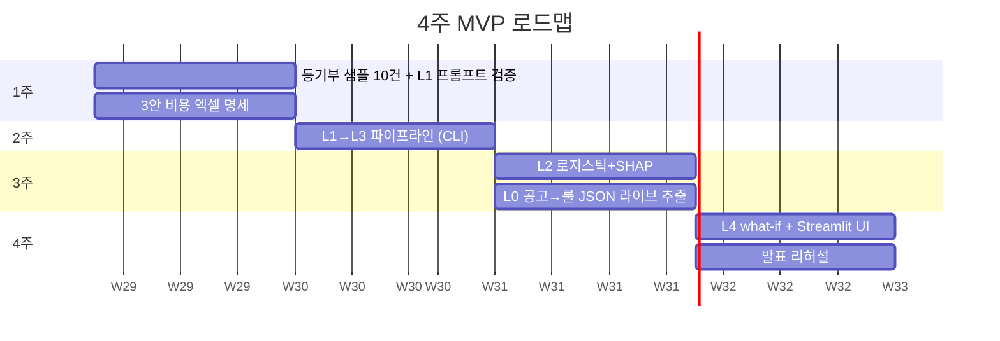

# 워크플로우 — 4주 MVP 계획 · 역할 · 데모 시나리오

> 사분면: How-to. "누가 언제 무엇을 만들어 데모까지 가는가"에 답한다.
> 무엇을 만드는지는 [design.md](design.md), 왜 그렇게 나뉘는지는 [architecture.md](architecture.md) 참조.

## 원칙: 수직 슬라이스

**페르소나 1명(김서연), 매물 2건(위험 빌라 vs 안전 오피스텔)으로 전 레이어(L0~L4)를 관통한다.**
넓게 얕게가 아니라, 좁게 끝까지. 데모에서 보여줄 경로 하나를 완주하는 것이 목표다.

## 팀 구성 · 역할 (3인)

| 담당 | 범위 | 산출물 |
|---|---|---|
| ① 금융 담당 | L3 계산 엔진 · 세제 명세 | 3안 비용 엑셀 명세 → Python 함수 + 단위 테스트 |
| ② LLM 파이프라인 | L0 · L1 · L4 | 등기부 파싱 프롬프트, 룰 추출 파이프라인, function calling what-if |
| ③ 모델 · 프론트 · 발표 | L2 · UI · 발표 | 로지스틱 회귀 + SHAP 플롯, Streamlit UI, 발표 자료 |

## 주차별 계획

| 주차 | 목표 | 산출물 (완료 기준) |
|---|---|---|
| 1주 | 데이터 검증 + 계산 명세 | 등기부 샘플 10건 확보, L1 추출 프롬프트 정확도 확인, 3안 비용 엑셀 명세 완성 |
| 2주 | L1 + L3 연결 | PDF → JSON → 계산 엔진 파이프라인 완주 (CLI 수준) |
| 3주 | L2 + L0 | 로지스틱 회귀 + SHAP 플롯 / 공고 1건 → 룰 JSON 라이브 추출 데모 |
| 4주 | L4 + 프론트 | Streamlit UI, function calling what-if 1~2개, 발표 리허설 |

## 레이어별 구현 범위 — 풀 버전 vs 4주 데모

| 레이어 | 풀 버전(제안서 기술) | 데모 구현(실제로 만드는 것) | 도구 |
|---|---|---|---|
| L1 문서 이해 | 파인튜닝 레이아웃 모델 | LLM API에 등기부 페이지 이미지+프롬프트 → JSON 추출, 샘플 10건 정확도 표 제시 | Claude/GPT 비전 API |
| L2 리스크 ML | XGBoost + KB 데이터 | 합성+공개 데이터 수백 건으로 로지스틱 회귀 + SHAP 플롯 — "모델 구조와 설명 체계" 시연 목적, 성능 수치 아님을 명시 | scikit-learn, shap |
| L3 계산 엔진 | 전체 세제 커버 | 전세/월세/매수 핵심 항목만 Python 함수화(엑셀 명세 → 코드), 단위 테스트 | pandas |
| L4 에이전트 | 멀티턴 에이전트 | LLM function calling으로 계산 엔진을 tool로 등록 → what-if 1~2개 시연 | LLM API tool use |
| L0 룰 파이프라인 | 상시 크롤링 + 검수 큐 | 공고 PDF 1건 업로드 → 룰 JSON 실시간 추출 → 즉시 자격 판정 반영 시연 (크롤러는 다이어그램으로) | LLM API + JSON 스키마 |

**다이어그램/목업으로만 제시하는 것**: L0 상시 크롤러·검수 큐, 계약 후 등기 변동 모니터링, 대출 실행 연계.

## 데모 시나리오 — 하이라이트 2장면

1. **룰 추출 라이브 시연**: 심사위원 앞에서 정책 공고 PDF를 넣으면 → 자격요건 JSON이 생성되고 → 페르소나의 자격 판정이 즉시 갱신됨. *"정책이 바뀌어도 DB를 사람이 다시 짜지 않습니다"*
2. **SHAP 워터폴 + 기대손실 막대**: "이 매물의 위험이 높은 이유"가 피처별로 분해되어 보이고, 그 위험이 ₩로 환산되어 전세 막대 위에 얹힘

발표 문구: *"저희는 AI를 세 겹으로 씁니다 — 문서를 읽는 AI, 위험을 예측하는 AI, 규칙을 쓰고 조작하는 AI. 계산만은 결정론으로 남겨둡니다. 금융에서 숫자가 틀리면 안 되니까요."*

## 개발 워크플로우 (작업 규칙)

1. **명세 먼저**: L3 세제 계산은 엑셀 명세로 합의 후 코드화. 함수마다 명세 셀과 1:1 대응하는 단위 테스트 작성
2. **스키마 게이트**: L1/L0 LLM 추출 결과는 JSON 스키마 검증 통과 전 하위 레이어 전달 금지
3. **추출↔검증 분리**: L0에서 추출 LLM과 검증 LLM을 분리하고, 경계값 테스트 통과 후에만 룰 DB 반영
4. **`[확인]` 마커 관리**: 미검증 수치는 `[확인]`으로 표시. 검증 완료 시 마커 제거 + 출처·기준일 기록. 제출 전 `[확인]` 잔여 0건이 목표
5. **기준일 버전 관리**: 룰 DB·데이터 소스에 조회/기준일을 반드시 저장 ("2026년 ○월 기준")

## 검증 (제출 전 체크리스트)

- [ ] 등기부 샘플 10건에 대한 L1 추출 정확도 표 완성
- [ ] L3 전 함수 단위 테스트 통과 (엑셀 명세와 결과 일치)
- [ ] 위험 빌라 / 안전 오피스텔 2건이 UI에서 서로 다른 결론("월세 유리" vs "전세 유리")을 냄
- [ ] 룰 추출 라이브 시연 리허설 성공 (공고 PDF → JSON → 자격 판정 갱신)
- [ ] what-if 1~2개 동작 ("연봉 500 오르면?" → 재계산 → 차이 해석)
- [ ] 모든 출력 수치에 원문 인용 표시
- [ ] 제안서 내 `[확인]` 항목 전수 재검증 (경쟁 서비스 최신 기능 포함)

## 정직성 원칙 (발표 전략)

- L2는 "성능"이 아니라 "설명 가능한 구조"를 보여주는 것 — 발표에서 **합성 데이터임을 먼저 밝히고** "KB 실데이터 결합 시 고도화"로 연결
- 한계를 먼저 말하는 팀이 신뢰를 얻는다: 등기부 외 리스크 미커버, 실시간 등기 API 부재 등을 선제 명시

## 트러블슈팅

| 문제 | 대응 |
|---|---|
| L1 추출 정확도가 낮음 | 프롬프트에 등기부 섹션 구조(표제부/갑구/을구) 명시 + few-shot 예시 추가. 샘플 10건 정확도 표로 개선 추적 |
| 공개 사고율 데이터 부족 | HUG 유형별 보증사고율을 베이스로 보수적 추정 + 합성 데이터로 구조 시연 (합성임을 명시) |
| 세법 조항 해석 불확실 | `[확인]` 마커 유지, 국가법령정보 원문 조항 확인 후 룰 DB에 조항 출처와 함께 기록 |
| what-if가 계산을 LLM에 시킴 | function calling 강제 — LLM 응답에서 숫자가 나오면 반드시 L3 tool 호출 결과에서 온 것인지 검증 |

## 관련 문서

- 모듈 스펙·수식·스키마 → [design.md](design.md)
- 계층 아키텍처 → [architecture.md](architecture.md)
- 프로젝트 원칙·컨벤션 → [CLAUDE.md](../CLAUDE.md)
